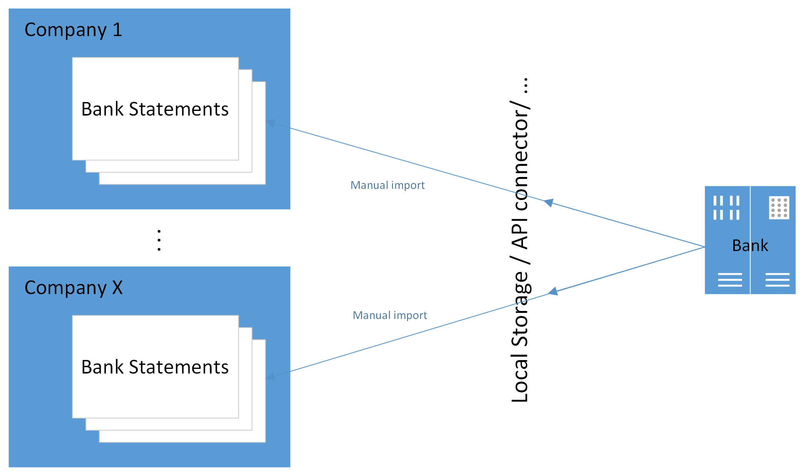
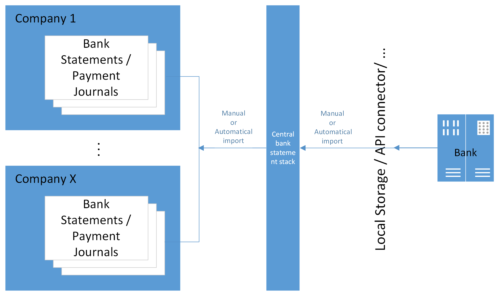

# CZ Banking Extension

> Update 30.05.2025

The module extends the functionality "Banking documents for Czech Republic (extension)", which is part of the Czech local functionality of D365 Business Central (hereinafter referred to as BC).

The main benefit of the Extended Banking module is to simplify the import and subsequent processing of bank statements, thereby reducing routine user activities.

The advantage is the variability in the setting of the import of bank statements into BC and their subsequent processing, where you can individually set the mode for each bank account separately.

The module allows to support users in processing statements in 2 levels: basic and advanced.

## Basic variant

### Bank statements

You gain access to the functionality by purchasing a subscription for your first bank account. This option does not determine the number of accounts for which you will use it. However, the work is manual within the company and for a specific bank, and in the case of multiple accounts with one bank, it supports importing multiple statements at once.
Also for this variant it is possible to purchase one of the offered add-ons for [API communications with the bank](cz-banking-extension-API-setup.md).

### Payment orders

In the basic version, the standard Export function on the Issued Payment Order page is used. In the case of a configured API, the statement is sent without downloading the file to the client computer.

## Advanced variant

### Bank statements

You can access the full automation functionality (except for the final posting of the Payment Journal) by purchasing a subscription for multiple bank accounts.
The advanced option provides the ability to automate all steps:

- Uploading bank statements (using methods without manual input, typically API or other custom developed methods)
- triggering bank statement imports across companies
- automating the processing of statements through to the creation of Payment Journal entries, including the suggestion of matching

### Payment orders

As part of the development of the module, support for automating the sending of Issued Payment Orders across companies and bank accounts will be completed during 2026.

## Use cases

The following chapters describe the most common scenarios for using the functionality to import statements and export payment orders.
The example scenarios describe the import of statements in .gpc format, see [Bank statement and payment order formats](cz-banking-extension-setup\#bank-statement-and-payment-order-formats).

### Basic - Import and processing of one statement

In this case, this is standard BC functionality. The user opens a new Bank Statement tab and starts the *Import Bank Statement* action.
After importing, the user uses the *Issue and Create Journal* function to post it.
> [!NOTE]
> For a detailed description of the functionality and settings see [CZ Bank Statements and Payment Orders](https://learn.microsoft.com/en-us/dynamics365/business-central/localfunctionality/czech/bank-feature?source=recommendations#bank-statement-and-payment-orders).

### Basic - Import and processing of bulk statement

This is a situation where one bank statement file contains multiple bank statements for one or more bank accounts.
For functionality settings, see [Bank Statements and Payment Orders formats](cz-banking-extension-setup\#bank-statement-and-payment-order-formats) a [Supporting settings for importing statements](cz-banking-extension-setup\#support-settings-for-importing-statements).
Settings for batch import - bulk statement and .zip, Supporting settings for BV import, Supporting settings for BV processing

1. Choose the  icon, enter **Import Bank Statements** and then choose the related link.
2. Start the **Import...** action.
3. Drag the file or click to browse and select the file
4. When you press OK, the Bank Statement Stack automatically opens. This is a temporary table for viewing imported statements and processing them immediately. Therefore, it is necessary to continue with the next step.
5. Run the **Processing** action to create the bank statement up to the set processing level.

> [!NOTE]
> When importing after selecting a file, you may receive the message "Nothing to import. Do you want to view a report with bank statements?" Clicking YES will display the files with error details.
> [!TIP]
> Most common errors:
>
> - The imported file already exists in BC --> in this case the status field shows the processing status in BC.
> - Bank account number was not recognized --> in this case the field "Bank account number" is shown in red.
    > - Either the imported file does not belong to the imported company
    > - or the bank statement file contains an account number in a different format, usually a prefix and an account number without a hyphen.  In this case, make the settings according to [Bank account number on the bank statement (optional)](cz-banking-extension-setup\#bank-account-number-on-bank-statement-optional).

### Basic - Import and processing of multiple statement files

This is typically a situation where files containing only one bank statement are used and multiple files need to be imported at once.
The files need to be compressed into a single .zip file to be imported, with automatic extraction taking place.
The procedure for importing a bank statement is the same as described in [Basic - Import and processing of bulk statement](#basic---import-and-processing-of-bulk-statement).

> [!NOTE]
> Multiple files can be passed at once directly in the file selection dialog (from BC26 version).

### Basic - Export Payment Order

Exporting payment orders is performed on the Issued Payment Order tab by running the *Export* action.

> [!NOTE]
> If you purchase one of the [API extensions](cz-banking-extension-API-setup.md), you can export the order directly to your bank's system.

### Advanced - manual import for multiple companies

The scenario describes a situation where there are multiple companies in the BC environment and the import of bank statements will be done centrally for multiple companies at once from a local repository.

It is imported into the Central bank statement stack table. The table records are common to all companies. Imported statements are stored here for further processing. After processing, it is advisable to delete them on an ongoing basis.
> [!TIP]
> In the Advanced CZ Banking Settings, turn on automatic cleaning.

1. Choose the  icon, enter **Central Bank Statement Stack** and then choose the related link.
2. Start the Import... action.
3. Drag the file or click to browse and select the file
4. When you press OK, the statements will automatically import into the Central Bank Statement Stack rows. Each statement will be filed on a separate line.

> [!NOTE]
> If you import a .zip file, the functionality will only import supported formats from compressed files. If there are unsupported formats in the .zip, the import ignores them.
>
> Multiple files can be passed at once directly in the file selection dialog (from BC26 version).

### Advanced - automated import for multiple companies

This is a situation where there are multiple companies in the BC environment and the import of bank statements will be done centrally for all companies automatically without user intervention.

An example would be direct communication with the bank via API, where BC directly downloads statements or executed transactions and stores them in the Central Bank Statement Stack for further processing.

For a description of the import automation settings, see [Automatic downloading of statements to the central stack](cz-banking-extension-setup\#automatic-downloading-of-statements-to-the-central-stack)
> [!TIP]
> Instructions for creating a custom import automation can be found in [Custom functions for downloading statements to the Central stack](cz-banking-extension-setup\#custom-functions-for-downloading-statements-to-the-central-stack).

### Advanced - manual processing of statements

Using the example of manual processing, we will show the steps that need to be performed after the statement has been loaded in order to reach the posting of the journal.

This method of processing may be useful in a situation with a large number of accountants, where each person is responsible for one or a few companies with multiple bank accounts. In this case, each user creates statements from one place in the companies or for the banks they are in charge of:

1. Choose the  icon, enter **Central Bank Statement Stack** and then choose the related link.
2. Choose the company name in the **Company name** field.
3. Enable the **Company Bank Statements Only** flag to display statements belonging to the selected company.
4. Select the *Process* function and confirm the execution by selecting *Yes*. This will create Bank Statements in the respective company for the rows for which they have not yet been created - you can see the result in the **Status** and **Bank Statement Number** columns.
5. Clicking on the value in the **Status** field (or directly on the *Bank Statement Number**) in the row will open either a Bank Statement, Payment Journal or Issued Bank Statement depending on the value of the Status field. Perform the next steps to post the statement in the Payment Journal.
6. Return to the Central Bank Statement Stack and continue with additional statements or another company.

> [!TIP]
> If a bank statement has not been created, or you are importing a new bank account, check the settings see [Bank Statement Processing Settings](cz-banking-extension-setup.md/#setting-up-automation-of-import-and-processing-of-bank-statements-via-the-central-stack)

### Advanced - automated processing of statements

Automated processing of imported statements is increasingly used not only in companies with a smaller number of accountants serving multiple companies with many bank accounts. The time saving consists in processing centrally imported statements according to set parameters, i.e. transferring them to individual companies including processing to a defined level (e.g. up to the draft lines in the Payment Journal).

The functionality knows which statements have already been imported and only fills in the missing ones (if the input file is not yet available or if the operator deletes the record in the central stack) at an interval of 14 days.

Through the Central Bank Statement Stack page, the user has an overview of the processing status of individual companies and can use it as a so-called dispatcher's counter (from the line, he can open a record in another company and change the status, e.g. post the statement):

1. Choose the  icon, enter **Central Bank Statement Stack** and then choose the related link.
2. Choose the company name in the **Company name** field.
3. Sort the **Statement Date** column in descending order.
4. Scroll to the row where the **Status** is not Posted. Click on the value in the **Status** field to open the record and perform the next steps to post the statement in the Payment Journal.
5. Return to the Central Bank Statement Stack and continue through the other rows until all are in the Posted status.

> [!NOTE]
> Verify settings for automation see [Supporting settings for automatic processing](cz-banking-extension-setup.md/#Support-settings-for-automatic-processing-of-statements).
> [!IMPORTANT]
> To work with the Central Bank Statement Stack, the user must have a standard set of permissions to create and process bank statements in the companies where the statements are to be served by this tool.

### Advanced - automated export of Payment Orders

The functionality will be added during 2026.

**See also**

[CZ Banking Extension Setup](cz-banking-extension-setup.md)  
[CZ Banking Extension APIs Setup](cz-banking-extension-API-setup.md)  
[Financial Pack](finance-pack.md)
