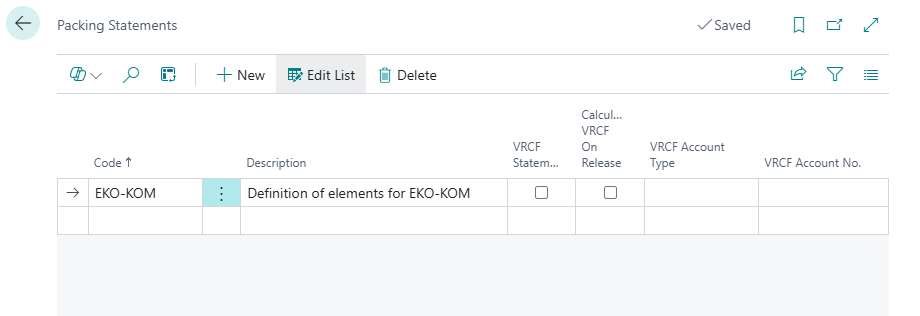
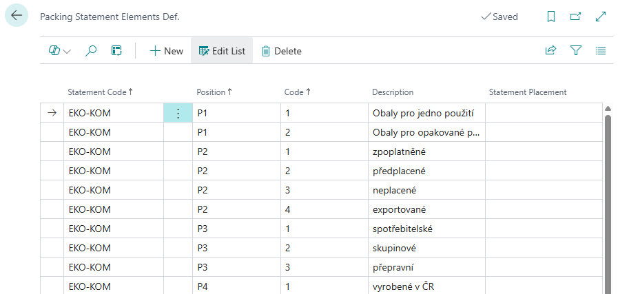
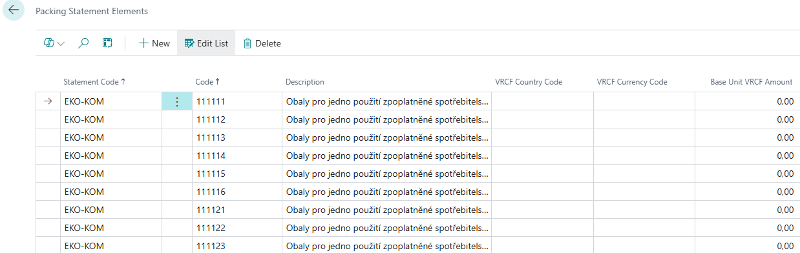
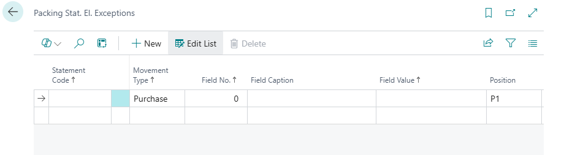

# Packaging Records (EKO-KOM) – Setup

> Updated: 03/01/2025

The first step when working with the **Packaging Records** module is to create **Packing Statements**. These represent the main categories that serve as the foundation for further packaging record configuration. You can create any number of statements in the system, each containing specific data based on company or legislative needs.

If you plan to work with **EKO-KOM** system parametrization, you must first create a **Packing Statement with the code EKO-KOM**. This step enables the correct import of files with predefined values.

Once the Packing Statement is created, you define detailed parameters that structure and characterize the packaging records. This process includes grouping packaging into specific categories and classifying them according to set criteria. Proper configuration ensures accurate records and simplifies legislative reporting.

Follow these steps for correct setup:

- **Create Packing Statement**
- **Parameterize EKO-KOM Packing Statement**
- **Define Packing Statement Elements Def. (statement structure)**
- **Create Packing Statement Elements (define the statement itself)**
- **Create exceptions in the Packing Statement**

## Creating the Packing Statement

1. Select the , enter **Packing Statements**, and select the related link.
2. On the **Packing Statements** page, create a new line with the **Code** EKO-KOM.

After filling in the **Code** and **Description**, you can also choose:

- **VRP Statement** – Indicates if this statement will be used to define visible recycling fees.
- **Calculate VRP when posting sales document** – Enables automatic recycling fee calculation on sales documents.
- **VRP Account Type** – Defines the account type used to record visible recycling fees in the sales document.
- **VRP Account Number** – Specifies the exact account for posting recycling fees.

## Parameterizing the EKO-KOM Packing Statement

For correct EKO-KOM reporting functionality, appropriate parameterization is required. All necessary setup files will be uploaded using configuration packages, ensuring fast and error-free data import.

To simplify this process, we have prepared a guided setup that will lead you through the entire configuration step by step. This way, you can easily apply the required data without manually setting each parameter.

1. Select the , enter **Assisted Setup**, and select the related link.
2. On the **Assisted Setup** page, under the **ARICOMA Extension Setup** tab, find **Setup Packaging Records EKO-KOM**.
3. Start the setup.

## Defining Packing Statement Elements Def.

Each created statement must have its elements defined. Each category (Position) contains individual elements (Code) describing specific packaging characteristics.

1. Select the , enter **Packing Statement Elements Def.**, and select the related link.
2. On the **Packing Statement Elements Def.** page, fill in the lines based on the following criteria:
    - **Statement Code** - Code of the statement created earlier.
    - **Position** - Defines the group of elements within the statement.
    - **Code** - Unique identifier of the element in the given position.
    - **Description** - Description of the statement element.
    - **Statement Placement** - Additional description specifying the element’s location within the statement.

For EKO-KOM, the completed table looks as follows:

## Creating Packing Statement Elements

On the **Packing Statement Elements** page, you define specific statement lines based on previously defined elements. Each line consists of a combination of categories and their individual elements, allowing precise identification of packaging materials based on their properties. The system automatically generates the description based on assigned values, eliminating classification errors.

1. Select the , enter **Packing Statement Elements**, and select the related link.
2. From the previously defined elements, define individual statement lines here.
3. The **Description** field is automatically completed by the system based on the values from the **Packing Statement Elements Def.** page.

## Creating Exceptions in the Packing Statement

You can define exceptions in each created **Packing Statement**, specified by item journal line conditions that will not be included in the statement.

1. Select the , enter **Packing Stat. El. Exceptions**, and select the related link.
2. On the **Packing Stat. El. Exceptions** page, specify **Statement Code**, **Movement Type**, **Field Number**, **Field Value**, and **Position**.

## See Also

[Packaging records](pack-tracking-basic.md)  
[Financial Pack](finance-pack.md)
