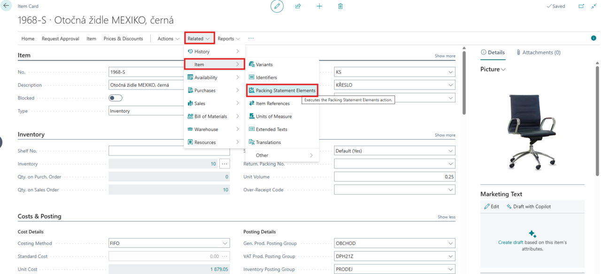
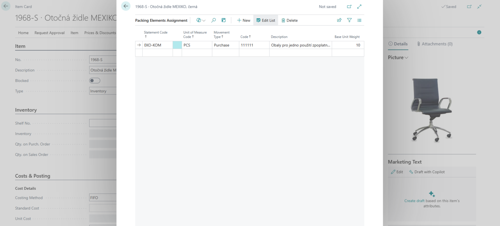
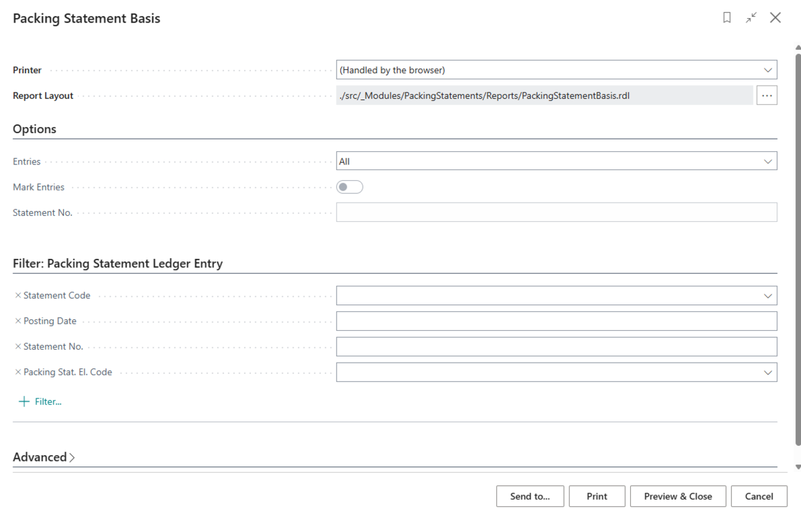

# Packaging Records (EKO-KOM)

> Update: 20.03.2025

Packaging plays a key role in the entire supply chain – it protects goods, facilitates handling, and helps meet legal requirements. However, managing packaging is often challenging, whether it involves **single-use packaging**, **reusable packaging**, or packaging with various charging conditions.

Manual tracking of packaging can be confusing and prone to errors. Companies often face discrepancies in reports, difficulties in data retrieval, or inefficient reporting to responsible institutions. The **Packaging Records (EKOKOM)** module automates this process and ensures accurate tracking throughout the entire packaging lifecycle.

## A Modern Approach to Packaging Records

The **Packaging Records (EKOKOM)** module for **Microsoft Dynamics 365 Business Central** gives you full control over all types of packaging. It allows you to record and track not only **single-use packaging** but also **reusable packaging**, and differentiate between **charged, prepaid, and free packaging**.

The system automatically links packaging to goods movements, eliminating the need for manual data entry. Thanks to full integration with **Packing Statements**, all legal documents are automatically prepared and compliant with the **Packaging Act No. 477/2001 Coll.**

### Key Features of the Packaging Records (EKOKOM) Module

- **Automatic tracking of all packaging types** - The module distinguishes packaging by usage and charging, allowing precise classification in accordance with company and legal requirements.
- **Full integration with inventory management** - Packaging is tightly linked to material flows and tracked along with goods movements, enabling precise monitoring of its status.
- **EKO-KOM legal reporting** - The system automatically generates **Packing Statements** and other outputs required by current legislation, eliminating errors and speeding up administrative processes.
- **Assign packaging elements to goods** - Each packaging item can be linked to specific products and tracked together within inventory management.
- **Clear reports and overviews** - Easily accessible reports give you up-to-date insights into your packaging management and ready-to-use data for reporting purposes.

## Assigning Packing Statement Elements

For the **Packaging Records** module to work properly, it is necessary to assign the corresponding **Packing Statement Elements** to item cards.

This assignment is done directly on the item card via **Related** > **Item** > **Packing Statement Elements**.

Each item and its unit of measure can be assigned to one or more **Packing Statements**. The assignment is based on the **Reporting Code** and **Movement Type**. These values together determine the correct category for the packaging in the statement. Filling in the **Code** sets the specific position in the statement, and the **Weight** field refers to the unit of measure in the statement line.

## Reporting

The **Packaging Records** module provides comprehensive tools for packaging management reporting. With the integrated system, you can easily generate reporting outputs and ensure compliance with legal requirements.

1. Select the , enter **Packing Statement Base** and then select the related link.
2. A dialog box with report setup options will appear.

In this report, you can configure:

- **Entries** - Allows you to choose whether to display **All**, **Not Reported**, or **Reported**.
  - **Not Reported** - Packaging not yet included in any **Packing Statement**. If you want to report it, you must enable the **Mark Entries** option.
  - **Reported** - Packaging already included in previous **Packing Statements**.
- **Mark Entries** - Available only when selecting **Not Reported**. This option allows you to mark packaging for reporting, ensuring that it will not appear as "unreported" in future reports.
- **Statement Code** - Used to uniquely identify a specific **Packing Statement**.
- **Filter: Packing Statement Ledger Entry** - Allows you to refine reported data by **Statement code, Posting Date, Statement number, or Packing Statement Element Code**.
  - If you activate the **Mark Entries** option, the system will automatically navigate you to the **Packing Statement Element Code** field, where you must select the appropriate classification.

After setting the parameters, you can export, print, or preview the report.

## See also

[Packaging records - Setup](pack-tracking-basic-setup.md)  
[Financial Pack](finance-pack.md)
