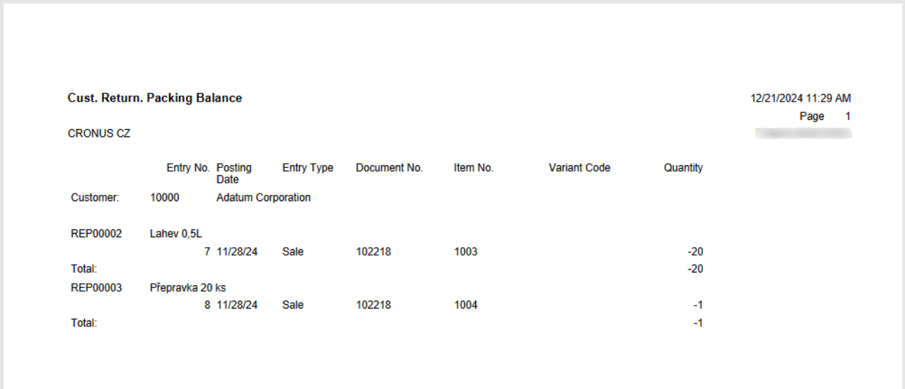
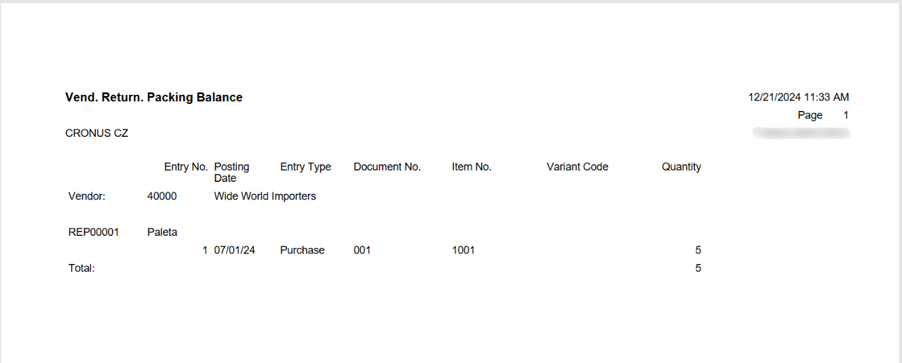

# Returnable Packaging records
> Update: 01.01.2025

In today's world, where **sustainability and efficiency are key**, returnable packaging plays a crucial role in modern businesses. Designed for repeated use, this packaging not only reduces the costs associated with single-use materials but also minimizes the environmental footprint. Companies use returnable packaging for transporting and storing goods, ensuring the safety and protection of products throughout the entire logistics process. Typical returnable packaging includes **pallets**, **crates**, **barrels**, **bottles** used for beverages, **containers**, and reusable **boxes**. Each type serves a specific purpose – from transporting heavy materials on pallets to storing liquids in barrels and beverages in bottles. Businesses track the movement of this packaging using modern information systems, ensuring efficient record-keeping, maintenance, and process optimization. This leads to significant cost savings and increased overall efficiency.

## The New Benchmark in Packaging Management Efficiency

The **Returnable Packaging** module in Dynamics 365 Business Central is your key to gaining complete control over packaging management. This module helps you **optimize the circulation of returnable packaging**, bringing **clarity** and **cost savings** to your business. Whether you are tracking **partner balances**, **managing purchase and sales transactions**, or requiring **detailed reporting**, this module has you covered.

Say goodbye to unnecessary chaos in warehouse management and embrace a system that saves you time, money, and the environment. See for yourself how easy it can be to manage complex returnable packaging records and contribute to a more sustainable future.

### Key Features of the Returnable Packaging Module

- **Standalone Returnable Packaging Records:** Our solution enables detailed tracking of returnable packaging, including numbers, descriptions, categories, and other key details. This ensures every package is always under control.
- **Integration with Inventory:** Within the standard inventory functionality, corresponding returnable packaging can be assigned to item cards. For example, an item card "Pallet" can be created and linked to a returnable packaging card "Pallet." This system ensures smooth integration and easy tracking of packaging during every item movement.
- **Automation on Documents:** Item cards with assigned returnable packaging can be added to purchase and sales documents. When documents are posted, returnable packaging entries are created to track the inflow and outflow of packaging. This process enables efficient tracking of supplier or customer packaging balances.
- **Returnable Packaging Journal:** For manual movements of returnable packaging, the Returnable Packaging Journal allows manual receipts and issues, setting initial balances, or making corrections based on actual conditions. This tool provides flexibility and accuracy in packaging management.

## Use Cases for Returnable Packaging

To make your work easier, we provide an overview of the most common scenarios you may encounter in everyday practice:

- **Setting Up a New Packaging Type**
- **Setting the Initial Quantity of Packaging**
- **Purchasing Goods Including Returnable Packaging**
- **Selling Goods Including Returnable Packaging**
- **Reports**

### Setting Up a New Package

1. Select the icon , enter **Return. Packing List** and then select the related link.
2. On the **Return. Packing List** page, select the **New** action.

3. After selecting the **New** action, the **Return. Packing Card** opens.

Each **Returnable Packaging Card** contains the following fields:

- **No.** – Select the number series for returnable packaging.
- **Description** – Name of the returnable packaging.
- **Return. Packing Category Code** – Identification of the returnable packaging category.
- **Search Description** - A description used for search purposes.
- **Net Change** – A non-editable field with a link to the "**Return. Packing Ledger Entries**" table. The displayed value indicates the balance status of the returnable packaging.
- **Expir. Date Form. in Sale** – Enter the period within which the customer is obligated to return the returnable packaging.
- **Expir. Date Form. in Purchase** – Enter the period within which you are obligated to return the returnable packaging to the supplier.
- **Blocked** – A field to block (prevent) further use of the specific returnable packaging card.

If specific values are set, they take precedence over general settings.

From the card, you can also use the Related action to view **Return. Packing Ledger Entries** and **Comments**.

Since each Returnable Packaging is considered an item, it is necessary to create an item card for the given returnable packaging and assign it a Returnable Packaging number. The choice of "dual" tracking is made to separate the monitoring of returnable packaging expiration from accounting operations.

1. Select the icon , enter **Items** and then select the related link.
2. On the **Items** page, select the **New** action.
3. The **Item Card** opens. Here, you enter information about the returnable packaging and assign the **Return. Packing No.**

### Setting the Initial Quantity of Packaging

To set the initial balances of packaging, we use the returnable packaging journals, which are also used for making adjustments and corrections.

1. Select the icon , enter **Return. Packing Journal** and then select the related link.
2. On the **Return. Packing Journal** page, fill in the following fields.

The Returnable Packaging Journal includes the following fields:

- **Entry Type** – Select whether it is Purchase, Sale, Positive Adjustment, or Negative Adjustment.
- **Document No.** – Enter the document number.
- **Returnable Packaging No.** – Select the number of the related returnable packaging card.
- **Item No.** – Select the number of the related item card.
- **Source Type** – A non-editable field automatically filled based on the Entry Type.
- **Source No.** – Select the number of the specific vendor.
- **Description** – Name of the returnable packaging.
- **Quantity** – Enter the quantity of returnable packaging units.
- **Applies-to Entry** – Select the entry to reconcile.

3. Once the required fields are filled out, use the **Print** action to verify that all entries are correct and complete.
4. Based on your preferences, select either the **Post** action or **Post and Print** for processing.

> [!WARNING]
> When using the Correction option in the Returnable Packaging Journal, posting does not pair entries based on the configured criteria.

### Purchasing Goods Including Returnable Packaging

When purchasing goods that include returnable packaging, it is essential to ensure that the packaging is properly recorded in the system. Returnable packaging is often used for transporting goods, making it crucial to include them on the purchase order to track their status and balances effectively.

#### Scenario

The purchasing department has decided to place an order with the supplier, Wide World Importers, in response to increased demand. The purchase order includes 5 units of **Athens Table (1896-S)** and 20 units of **Paris Chair, Black (1900-S)**. According to the supplier, the goods will be delivered on 6 pallets, which will be recorded as returnable packaging. Proper tracking of these pallets will enable efficient management and monitoring of their balances.

#### Solution

1. Create a new purchase order.
2. Fill in the supplier details in the General tab.
3. On the order lines, select the desired items and quantities.
4. Additionally, manually add the item created for the returnable packaging.

> [!IMPORTANT]
> For proper functionality, the item card must be linked to the returnable packaging card, as outlined in **Setting Up a New Packaging Type**.

### Selling Goods Including Returnable Packaging

When selling goods that include returnable packaging, it’s essential to ensure the packaging is accurately recorded in the system. Returnable packaging is often used for transporting sold goods, so it’s important to include them on the sales order. This ensures precise tracking of their status and balances.

#### Scenario

A customer has ordered 1 unit of **Athens Table (1896-S)** and 4 units of **Paris Chair, Black (1900-S)**. To fulfill this order, a sales order must be created that includes not only the items themselves but also the returnable packaging item—a pallet that will be used for transporting the goods.

#### Solution

1. Create a new **Sales Order**.
2. Fill in the customer details in the **General** tab.
3. On the order lines, add the ordered items and their quantities.
4. Additionally, manually include the item created for the returnable packaging.

> [!IMPORTANT]
> For proper functionality, the item card must be linked to the returnable packaging card, as outlined in **Setting Up a New Packaging Type**.

## Reports

For efficient management of returnable packaging, various reports are available within the relevant module pages. These reports provide an overview of movements, balances, and other details related to returnable packaging.

Select the icon , enter the desired report, and then choose the related link to have the report printed.

- **Packing Statement Basis:** Used to prepare documentation for reporting purposes.
- **Return. Packing Posting - Test:** Allows testing the accuracy of returnable packaging posting.  
- **Return. Packing Registers:** A record is created in the Returnable Packaging Registers (similar to the Item Journal) every time a returnable packaging entry is posted.

- **Return. Packing Register - Quantity:** Provides detailed quantity movements for individual returnable packaging journals.
  - On the line **No.**, select the specific journal for which you want to view the details.

- If the line is left blank, the report will print details for all journals. See the image below for reference.

- **Return. Packing - Detail:** Provides a detailed history of all returnable packaging movements.
- **Return. Packing Movement:** Offers an overview of returnable packaging movement between warehouses or customers.  
- **Cust. Return. Packing Balance:** Displays the current balance of returnable packaging for individual customers.
  - You need to specify the customer **No.** and the period (date) for which you want to check the balance.
  - The report can be run for either the **Sell-to** or the **Bill-to**.

- **Vend. Return. Packing Balance:** Displays the balance of returnable packaging with your vendors.
  - You need to specify the vendor **No.** and the period (date) for which you want to check the balance.
  - The report can be run for either the **Buy-to** or the **Pay-to**.

## See also

[Returnable Packaging records - Setup](pack-tracking-return-packing-setup.md)  
[Financial Pack](finance-pack.md)
