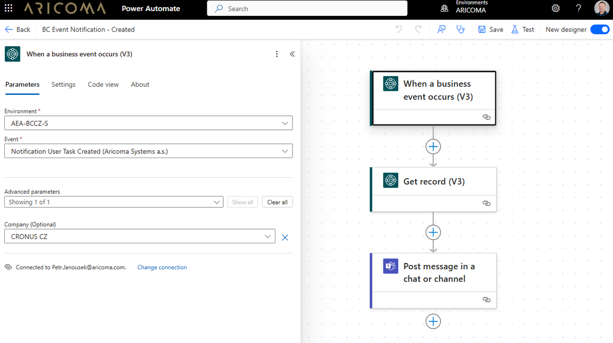

# Notifications

The Event Notifications module in Dynamics 365 Business Central allows users to easily create alerts for various tables and fields without the need for programming. With the ability to filter records, users can monitor only relevant items and define event phases to track their progress over time. Alerts are typically generated as User Tasks and can also be sent via email. Email notifications can either have a fixed, simple structure or dynamic content created through the Word Layout functionality.

For advanced notifications, the module generates business events, enabling connections with external systems such as Power Automate, Dataverse, and others. These systems can respond to events and perform additional actions, such as creating notifications in Teams or records in SharePoint. Alerts can be created manually or automatically through the Job Queue, ensuring flexibility and efficiency in process management.

## Key Features

- **User-defined system event notifications:** The module allows flexible creation of alerts for almost any system tables and fields without the need for additional programming. Records can be filtered in various ways to monitor only the desired items.
- **Event tracking over time:** Users can define event stages and track their progress over time, enabling proactive responses and better process management.
- **Alerts as User Tasks and via email:** Alerts are typically created as User Tasks and can also be sent via email, ensuring that users are always informed.
- **Integration with Power Automate for advanced notifications:** The module also generates business events, enabling connections with external systems such as Power Automate, Dataverse, and others. These systems can respond to events and perform additional actions, such as creating notifications in Teams or records in SharePoint, increasing automation and efficiency.
- **Manual and automatic alert creation:** Alerts can be created manually by running the Process Event Templates function or automatically through the Job Queue, providing flexibility and convenience in managing notifications.

## Practical Use Cases

- Notification of upcoming expiration of sales quotes
- Notification of creation of a Sales Order with a delivery date shorter than 2 weeks
- Notification of approaching due date of receivables
- Notification of new item creation
- Notification of new customer or vendor creation
- Notification of creation of a new production, assembly, or service order
- Notification of completion of a production, assembly, or service order
- Notification of assignment of a Service Order
- Notification of payment of a prepayment invoice
- Notification of posted receipt to a specified warehouse
- Notification of transfer of items to a specified warehouse, e.g., shipping location, recycling warehouse for item disposal, etc.

**See also**  

[Event Notifications - setup](notifications-setup.md)  
[Productivity Pack](productivity-pack.md)
