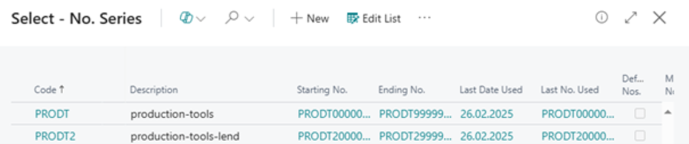
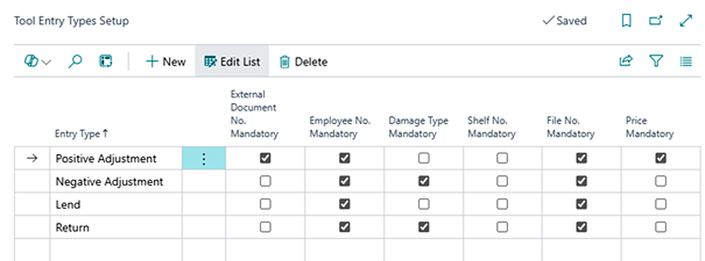
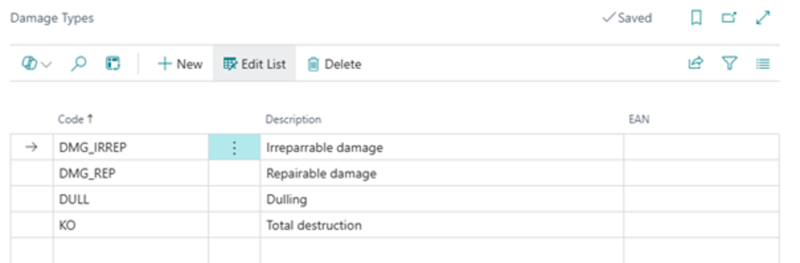

# Production tools - setup

The **Production Tools** Module addresses the management of tools, equipment, molds, and other assets that are typically tracked through the system’s inventory management. This module is built on the foundation of asset management, ensuring a unified tracking system for both fixed asset monitoring and production-related needs, such as tool and equipment loans.

For full utilization of the module, it must be configured according to the specific needs of the company. The following sections describe the individual setup components. 

### Tool Journal Templates 

1. Select the icon and type **Tool Journal Templates** in the search bar and choose the related link. 
2. The **Tool Journal Templates** page will open. 
3. Click the **+ New button** to create a new template. 
4. In the Template **Name field**, enter a name that best describes the purpose of the template.
5. In the **Default Entry Type field**, select an entry type, such as **Lend**, if the template is intended solely for loan tracking. 
6. In the **Document No. Series** field, enter or select the numbering series that will be used for transaction records. 
7. Save the template by clicking **Save**. 

> [!IMPORTANT]  
> At least one **Tool Journal Template** must be created to enable tool transactions. 
> [!TIP]
> It is possible to have a single template for all types of transactions by leaving the **Default Entry Type field** empty when creating the template.

### Adding a No.Series 

1. Click on the **No.Series field**.
2. The **Number Series** page will open.
3. Click the **+ New** button to create a new number series.
4. In the **Code** field, enter a unique identifier for the number series.
5. In the **Description field**, provide a brief description explaining the purpose of the number series.
6. Enter the **starting** and ending **number** of the series in the **Starting Number** and **Ending Number** fields.
7. Check the **Default Nos.** box if you want the system to automatically generate numbers within this series.
8. Save the number series by clicking **Save**.

### Tool Entry Types Setup 

Each Tool Journal Template can have defined mandatory field validations. Follow these steps:

1. Select the icon  and type **Tool Entry Types Setup** in the search bar, then choose the related link.
2. The Tool **Entry Types Setup** page will open.
3. Click the **+ New button** to create a new row for the specific entry type.
4. Select an Entry Type from the following options:

    - **Positive Adjustment** – Adding tool quantities to the records.
    - **Negative Adjustment** – Removing tools from the records.
    - **Lend** – Recording tool loans.
    - **Return** – Recording the return of borrowed tools.

5. For each Entry Type, define the mandatory fields that must be filled in the Tool Journal.

> [!NOTE]  
> Mandatory fields help ensure the accuracy of records in the journal and proper tracking of tools 

### Damage Types Setup

The Damage Types Setup helps differentiate recorded damaged tools. This information can be used for potential employee compensation for returned damaged tools or for later statistical analysis.

1. Select the  icon and type **Damage Types** and select the related link.
2. The **Damage Types** page will open.
3. To add a new damage type, click the **+ New** button.
4. Fill in the following fields:

   - **Code** – A unique code for the damage type.
   - **Description** – A textual description of the damage.
   - **EAN** – A barcode that can be used with barcode scanners.

5. Complete the fields as needed and save the settings.

> [!NOTE]  
> Properly defining **Damage Types** allows for more accurate tracking and better analysis of tool conditions in the future. 

**See also**

[Evidence nářadí a pomůcek](production-tools.md)  
[Productivity Pack](productivity-pack.md)
