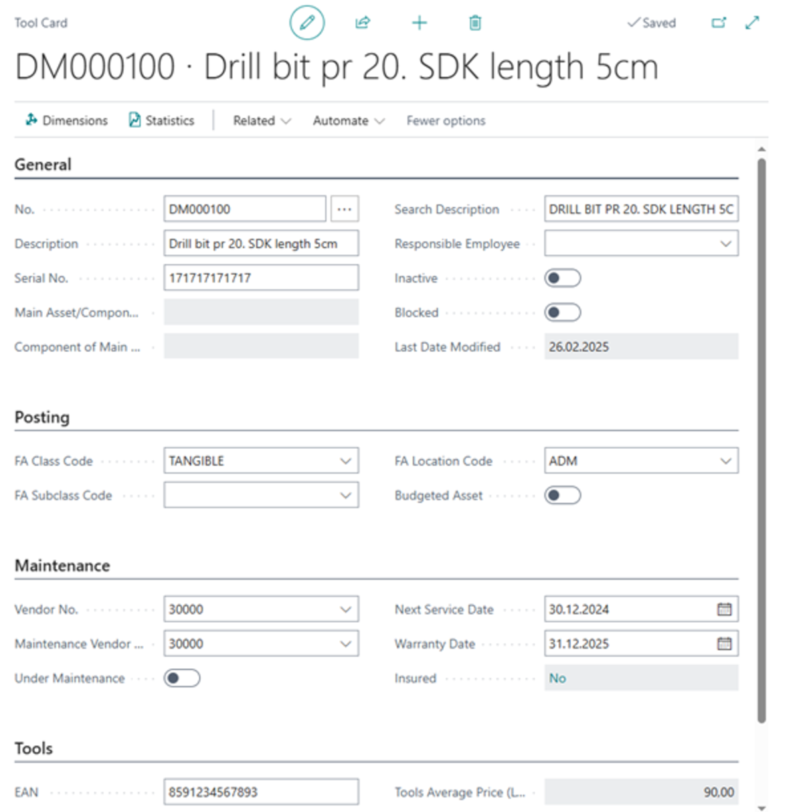
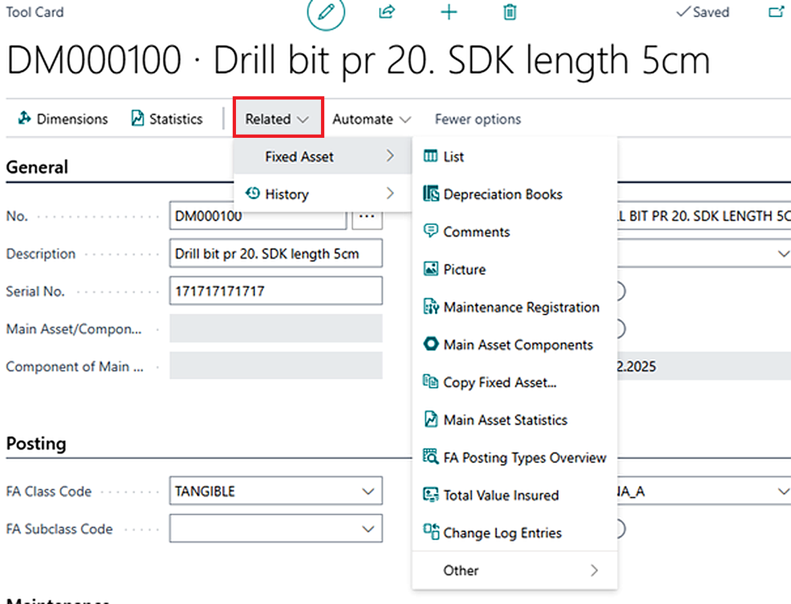
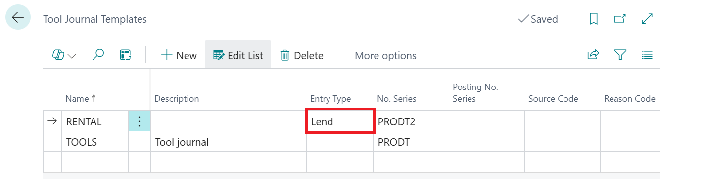
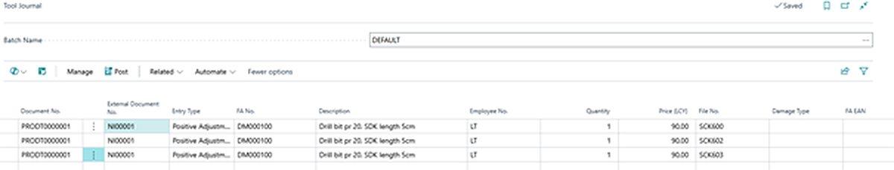
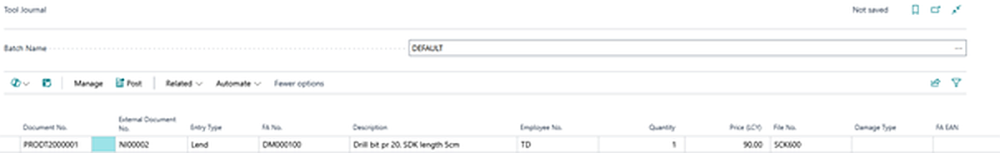
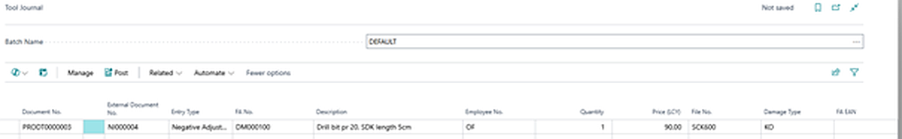
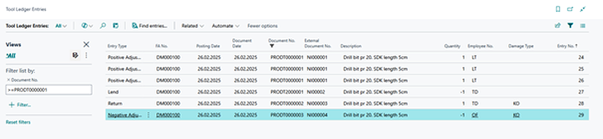

# Production Tools
Gain full control over your tools and equipment with our smart solution, seamlessly integrated into the Business Central system. Track tool movements, minimize losses, and extend their lifespan with an easy-to-use overview of records, loans, inspections, and maintenance. 
 
The Production Tools Module addresses the management of tools, equipment, molds, and other assets that are typically tracked through the system's inventory management. This module is built on the foundation of asset management, ensuring a unified tracking system for both fixed asset monitoring and production-related needs, such as tool and equipment loans. 

### Key Features of the Module

- **Tool Receipt:** Enables easy registration of each new tool. Gain an overview of equipment availability status from the very beginning.
- **Tool Loan:** Makes it easier to manage loans, whether for short-term or long-term use. Track who currently has the tools borrowed.
- **Tool Return:** Ensures an overview of the tool's condition upon return and allows for immediate record updates.
- **Tool Disposal:** Allows for the easy removal of damaged or obsolete tools, making space for new equipment.

### Tool Usage Process

The use of tools follows this sequence

Sem vložit obrázek schéma

### Use Cases for the Production Tools Module

To make your work easier, here is an overview of the most common scenarios you may encounter in daily practice:

- **Adding a New Tool:** Registering a new tool in the system.
- **Receiving Tools into Stock:** Recording tools using Positive Adjustment to update inventory.
- **Lending Tools:** Issuing tools to users with a Lend entry in the tool journal.
- **Returning Tools:** Recording the return of borrowed tools using the Return function.
- **Issuing Tools:** Removing tools from stock or marking them as unavailable using Negative Adjustment.

### Adding a New Tool

1. Select the icon , then type **Tool List** in the search bar and choose the related link.
2. On the **Tool List page**, select the **+New** action.

3.	After selecting the New action, the **Tool Record** Card will open.

Each Tool Record Card contains the following fields:

- **No.:** Select the numbering series for tool records.
- **Description:** The name of the tool.
- **Serial No.:** The tool’s serial number.
- **Main Asset/Component:** Defines the primary data source of the tool.

4. After filling in the fields in the Tool Record Card, the tool will be saved in our **Tool List**.

**List** – Displays a summary view of the currently selected fixed asset. This overview includes key information such as asset description, accounting category, current balances, and other relevant details.

**Depreciation Books** – Provides access to an overview of depreciation books linked to the asset (tool). Here, you can track depreciation history, applied depreciation methods, and other accounting movements of the asset.

**Comments** – Used for adding and managing notes related to a specific fixed asset. This allows recording specific details that are not typically stored in other parts of the system.
**Picture** – This function allows attaching or displaying images related to the fixed asset. Images can be useful for visual identification or documentation of the asset.

**Maintenance Registration** – Provides access to maintenance records for the fixed asset. This function is designed for tracking service interventions, repairs, and other maintenance activities, ensuring the asset remains operational.

**Main Asset Components** – Displays an overview of the components that form the main asset. This function is especially relevant for complex assets consisting of multiple parts.

**Copy Fixed Asset...** – Allows creating a copy of the current fixed asset record. This function saves time when setting up a new asset with similar parameters to an existing item.

**Main Asset Statistics** – Provides a statistical overview of the fixed asset, including information on asset value, depreciation, and balances. These data are useful for financial analysis and planning.

**FA Posting Types Overview** – Displays an overview of all posting types used for the given fixed asset, allowing a quick review of how the asset has been processed in accounting.
**Total Value Insured** – Provides information about the total insured value related to the asset, helping to verify whether the asset is adequately insured.

**Change Log Entries** – Allows viewing the history of changes made to fixed asset records. This function is useful for auditing purposes or tracking modifications retrospectively.

### Tool acquisition

1. Select the icon , then type **Tool Journal** in the search bar and choose the related link.
2. Choose a template that best fits your needs.
3. Enter the **external document number** in the corresponding field.
4. For **Entry Type**, select **Positive Adjustment**, then choose the tool you want to record.
5. Fill in the **Employee No.** field for the person responsible for receiving the tools.
6. Enter the required values in the **Quantity** and **Cost** fields.
7. Specify the Tool Serial No. to ensure unique identification of each tool for future operations.
8. If you use barcode scanners, you can also enter the **EAN Code**.
9. Click **Post** to save the entry into the records.
10. All created entries can be tracked on the **Tool Ledger Entries** page.

**Tool journal Lines:**

> [!IMPORTANT]  
> **Mandatory Fields for Entry Type "Positive Adjustment":** External Document No., Employee No., Serial No., Cost. 

### Tool Lending

1. Select the icon  and type **Tool Journal** in the search bar, then choose the related link.
2. Choose a template that best fits your needs.
3. Fill in the **Fixed Asset No.** field.
4. In the **Employee No.** field, select the employee borrowing the tool.
5. Enter the **Quantity**.
6. Fill in the **Serial No.** field with the specific tool being loaned.
7. If you use barcode scanners, you can also enter the **EAN Code**.
8. Click **Post** to save the entry into the records.
9. All created entries can be tracked on the **Tool Ledger Entries** page

**Tool journal Lines:**

> [!IMPORTANT]  
> **Mandatory Fields for Entry Type "Lend":** Employee No., Serial No. 

### Tool Return

1. Select the icon  and type **Tool Journal** in the search bar, then choose the related link.
2. Choose a template that best fits your needs.
3. For **Entry Type**, select **Return**.
4. In the **FA No.** field, select the tool you want to return.
5. Fill in the **Employee No.** field for the employee returning the tool.
6. Enter the **Quantity** field with the number of tools being returned.
7. Fill in the **Serial No.** field to uniquely identify the specific tool.
8. If applicable, enter a value in the **Damage Code field**.
9. If you use barcode scanners, you can also enter the **EAN Code**.
10. Click **Post** to save the entry into the records.
11. All created entries can be tracked on the **Tool Ledger Entries** page.

**Tool journal Lines:**

> [!IMPORTANT]  
> **Mandatory Fields for Entry Type "Return":** Employee No., Damage Code, Serial No. 

### Tool Disposal

1. Select the icon and type **Tool Journal** in the search bar, then choose the related link.
2. Choose a template that best fits your needs.
3. For **Entry Type**, select **Negative Adjustment**.
4. In the **FA No.** field, select the tool you want to issue.
5. Fill in the **Employee No.** field with the person performing the action.
6. Enter the **Serial No.** field to uniquely identify the specific tool.
7. If applicable, enter a value in the **Damage Code field**.
8. If you use barcode scanners, you can also enter the **EAN Code**.
9. Click **Post** to save the entry into the records.
10. All created entries can be tracked on the **Tool Ledger Entries** page.

**Tool journal Lines:**

> [!IMPORTANT]  
> **Mandatory Fields for Entry Type "Tool Issuance":** Employee No., Damage Code, Serial No. 

### Tool Ledger Entries

As mentioned earlier, all created entries can be tracked on the Tool Ledger Entries page. Here’s how to access this page:

1. Select the icon and type **Tool Ledger Entries** in the search bar, then choose the related link.
2. The **Tool Ledger Entries** page will open, where you can monitor all recorded transactions.

> [!TIP]
> You can also access the **Tool Ledger Entries** page using the keyboard shortcut **CTRL + F7** from the **Tool List page** or from individual tool records. 

**See also**

[Evidence nářadí a pomůcek - nastavení](production-tools-setup.md)  
[Productivity Pack](productivity-pack.md)
