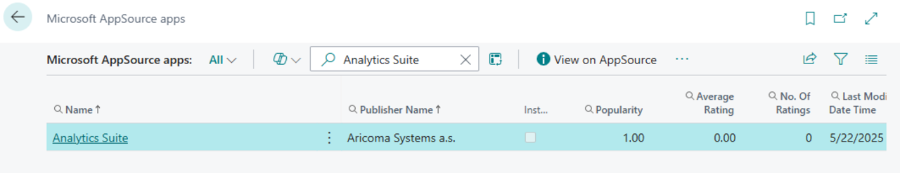
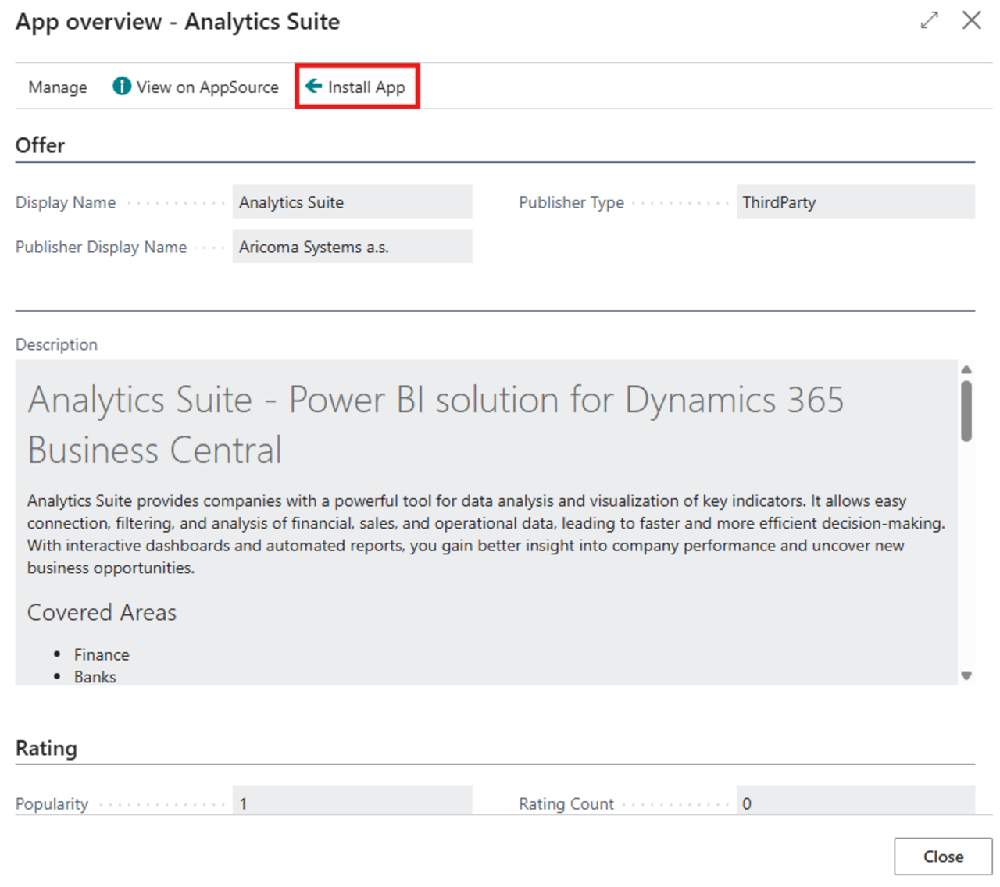
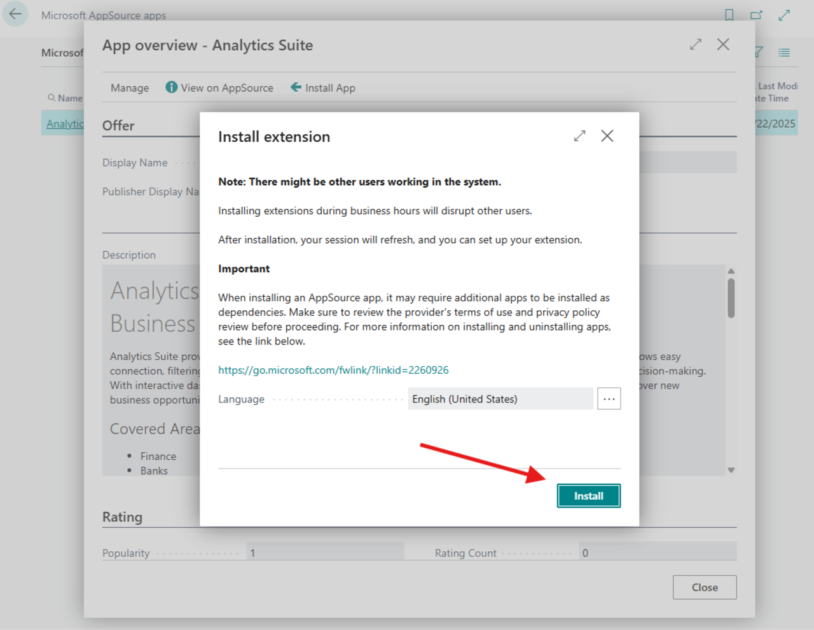
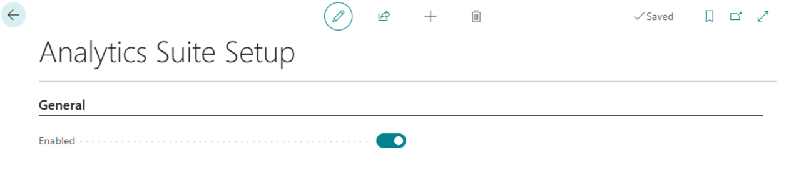
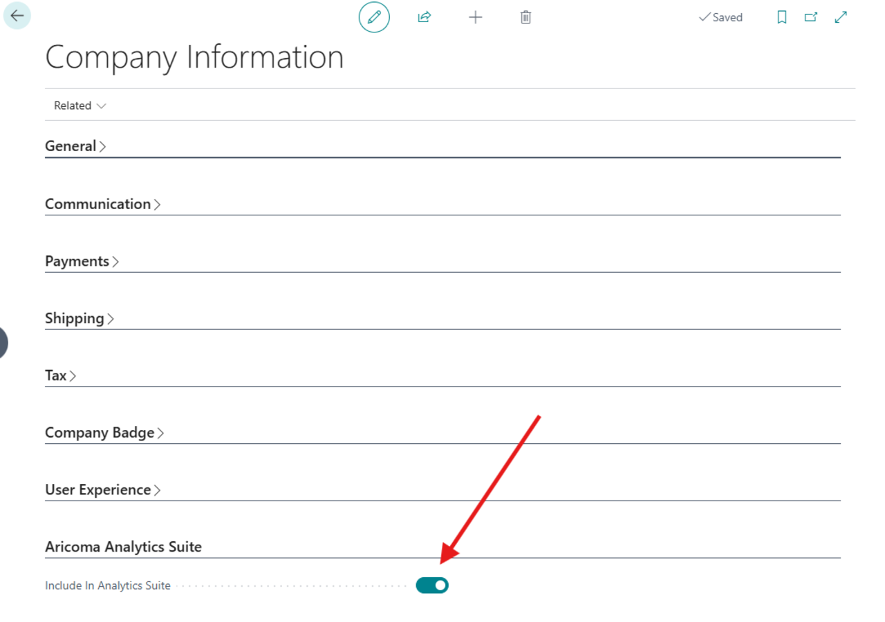
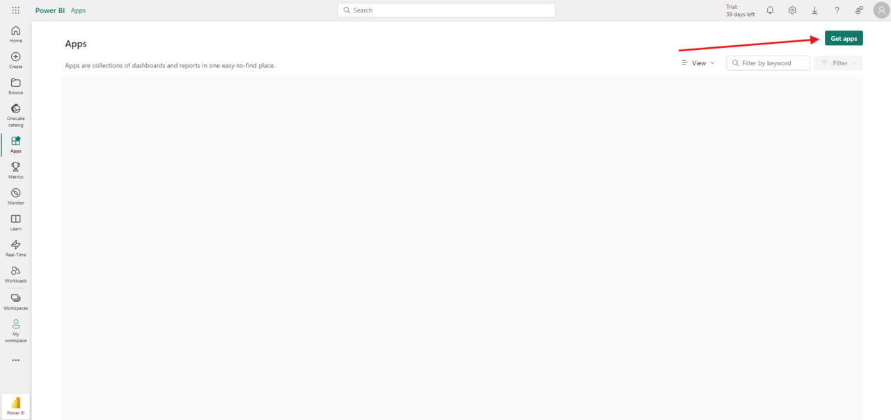
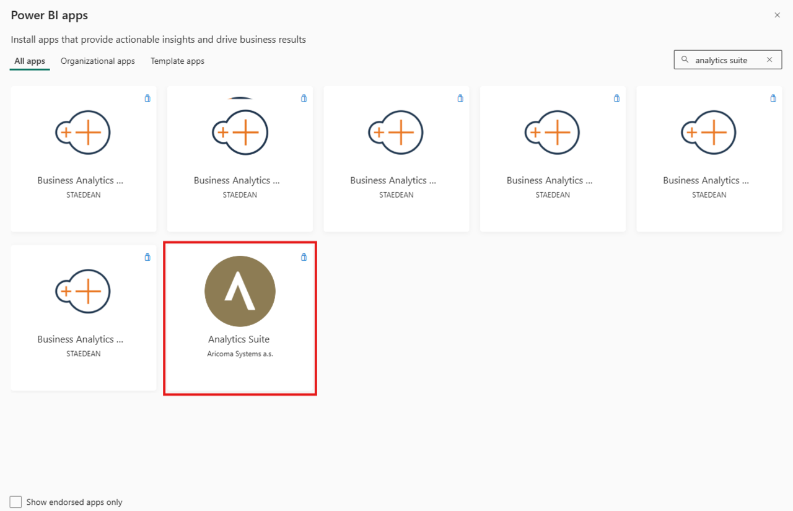
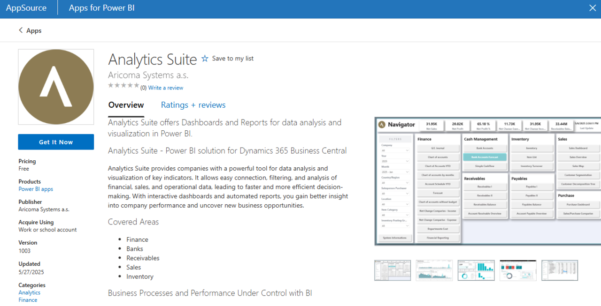
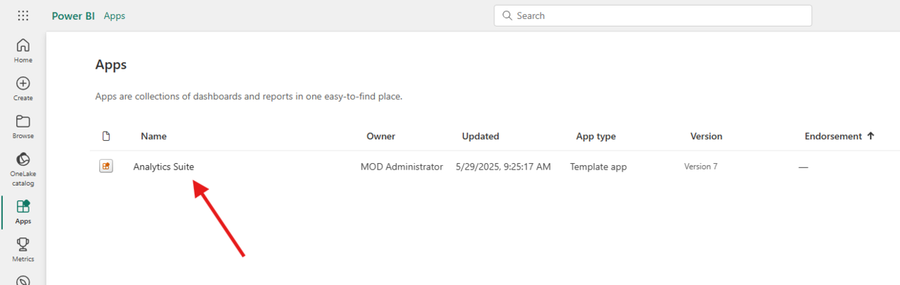
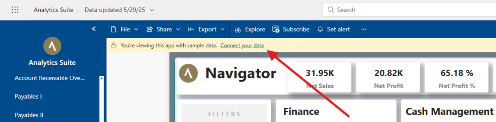

# Analytics Suite – Setup

> Updated: 01/06/2025

The **Analytics Suite** module enhances data analysis and key performance indicators visualization capabilities within Dynamics 365 Business Central. To ensure proper functionality, follow these setup steps:

- **Install the extension in Business Central**
- **Configure Analytics Suite in Business Central**
- **Connect the Power BI application to your data**

## Install the extension in Business Central

1. Sign in to your Business Central environment.
2. Open **AppSource** and search for **Analytics Suite**.

3. Select the **Analytics Suite for Business Central** extension and click **Install app**.

4. Follow the installation wizard to complete the setup.

## Configure Analytics Suite in Business Central

1. Select the icon , type **Analytics Suite Setup**, and then select the related link.
2. On the **Analytics Suite Setup** page, activate the module by checking the **Enabled** checkbox.

3. Select the icon , type **Company Information**, and then select the related link.
4. On the **Company Information** page (and for other companies you want to analyze in Analytics Suite), enable the option **Include in Analytics Suite**.

## Connect the Power BI application to your data

To display reports and dashboards correctly, you need to link the Power BI application to your Business Central environment:

1. Go to [powerbi.com](https://powerbi.com) and sign in.
2. In the left-hand menu, select **Apps**.
3. Click **Get Apps**.

4. In the search box, type **Analytics Suite** and select the app by **Aricoma**.

5. Click **Get it now** and install the application.

6. Open the **Analytics Suite** app in the relevant workspace.

7. Click **Connect your data**.

8. In the **EnvironmentName** field, enter the name of your Business Central environment.

## See also

[Analytics Suite – Overview](analytics-suite.md)  
[Streamline Tools](streamlinetools.md)
