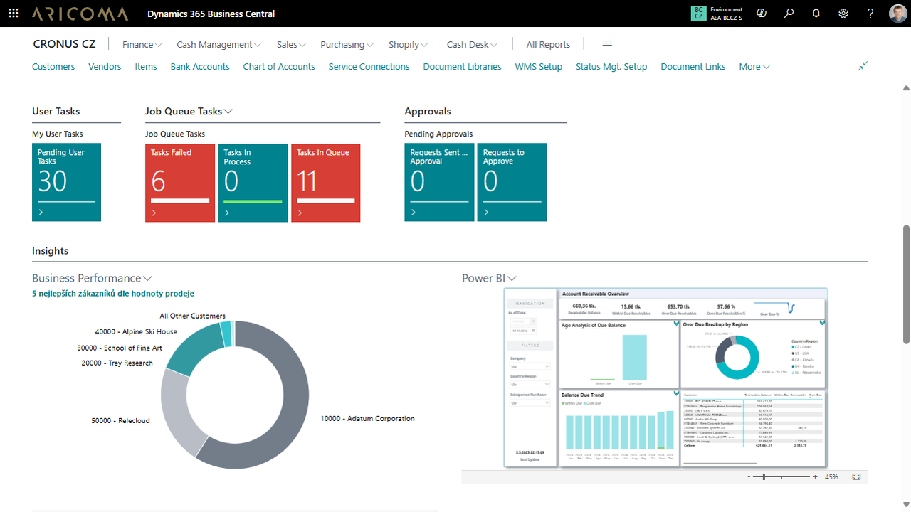
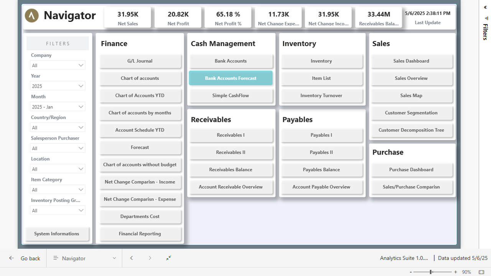
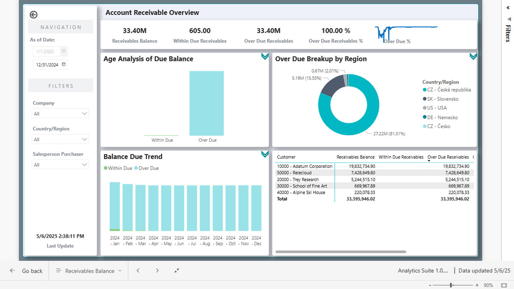
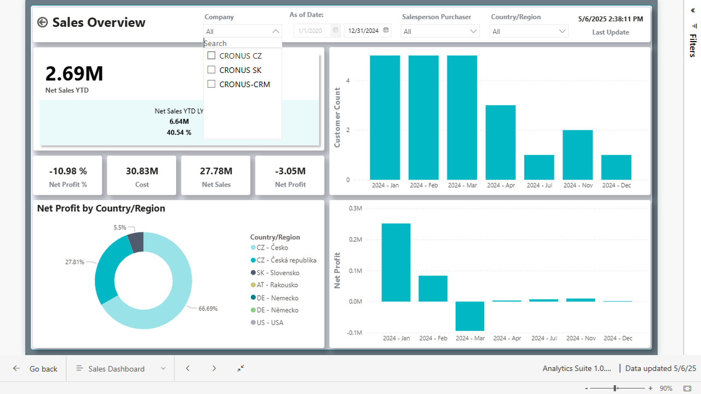
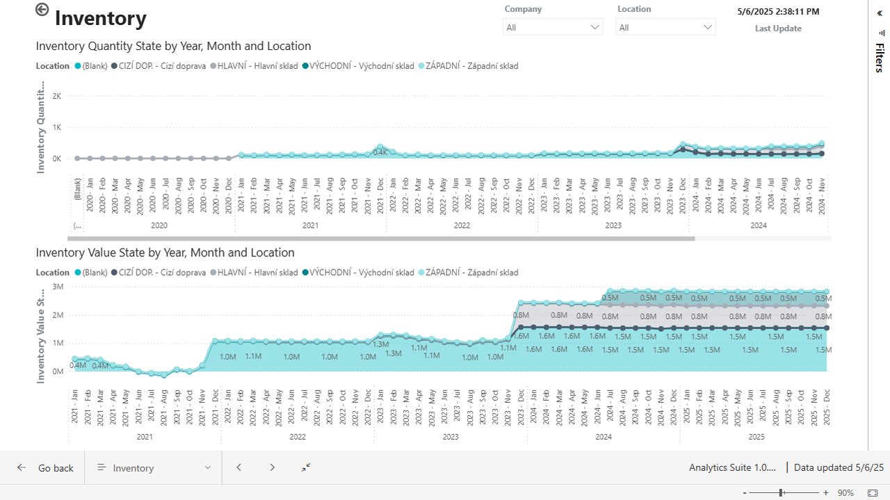

# Analytics Suite - Power BI solution for Dynamics 365 Business Central

> Updated: 01/06/2025

Analytics Suite provides companies with a powerful tool for data analysis and visualization of key indicators. It allows easy connection, filtering, and analysis of financial, sales, and operational data, leading to faster and more efficient decision-making. With interactive dashboards and automated reports, you gain better insight into company performance and uncover new business opportunities.

## Covered Areas

- Finance
- Banks  
- Purchase and Payables
- Sales and Receivables
- Inventory

## Business Processes and Performance Under Control with BI

Business Intelligence (BI) tools help companies effectively manage key processes, reduce costs, optimize sales volume, and select development projects correctly. They enable detailed analysis of project profitability, identification of funds tied up in inventory or receivables, and their efficient release. Advanced data handling helps uncover untapped market potential, recognize trends, and optimize resource utilization.

The system provides an overview of receivables data and allows detailed analysis. It offers the possibility to compare data over different time periods and interactive reports that ensure immediate feedback and the ability to analyze data from various perspectives.

Thanks to a ready-made solution that can be easily customized to individual needs, deployment is quick and does not require additional investments. Users can connect and supplement additional data sources, adjust the data model according to specific requirements, and create their own dashboards and reports, for example, by linking with payroll systems or budgets in Excel.

The system is fully integrated with Business Central, allowing easy connection with company data and efficient real-time process management.

## Finance

Analytics Suite for finance provides a comprehensive overview of key financial indicators such as revenues, costs, and profitability. It enables detailed budget analysis, trend monitoring, and deviation identification, facilitating financial management optimization and strategic planning.

The solution is fully integrated with Financial Statements defined in Business Central and allows users to create interactive reports on financial data. It offers analyses of payroll costs, revenue comparisons by centers, or other dimensions defined in Business Central. With intuitive controls and customizable visualizations, you gain an immediate overview of the company's financial performance and support effective decision-making.

### Banks

Analytics Suite for banking data provides a comprehensive overview of financial transactions, account balances, and cash flow. It allows monitoring of payment operations and managing liquidity with higher accuracy, quickly responding to changes in financial flows.

Users can easily analyze incoming and outgoing payments, monitor account balance developments, and identify potential financial risks. The module also allows comparison of historical data with current trends, supporting better decision-making in finance and banking operations.

### Receivables

Receivables management provides an overview of customer payment behavior, helping to identify the risk of unpaid invoices. Advanced analytical tools allow monitoring receivables development over time and optimizing their collection process.

A key indicator is the turnover of receivables, which expresses how quickly receivables are converted into cash. It is measured by the ratio of the volume of owed money to the average collection period and helps identify potential liquidity problems.

Interactive analytical overviews allow a detailed view of the receivables structure, identification of overdue invoices, and categorization of owed amounts by time intervals (e.g., 30, 60, 90 days). Visualization of this data enables quick response to risky situations and more efficient financial management.

## Sales

Analytics Suite for sales provides a detailed overview of sales results from various perspectives, including customers, products, locations, or individual salespeople. It allows analysis of customer behavior, identification of the most profitable products and markets, and optimization of sales strategies for maximum revenue growth.

Advanced analytical tools enable monitoring of key indicators over time, such as sales development from the beginning of the year or their comparison with the previous period. This allows effective evaluation of sales trends, identification of seasonal fluctuations, and adjustment of business strategy to current market conditions.

## Inventory

Inventory management provides a detailed overview of stock levels, product turnover, and supply chain efficiency. It helps minimize excess inventory, optimize orders, and reduce storage costs.

Product turnover is a key indicator of warehouse management efficiency. Analysis of product turnover allows better planning of purchases, optimization of warehouse capacities, and efficient cash flow management.

## Benefits

- Immediate access to financial, sales, and other data, even for multiple companies in one view, facilitates effective decision-making and management.
- Interactive dashboards provide a basis for strategic management and allow better insight into company performance.
- Mobile device support simplifies access to data and reports from anywhere, increasing flexibility and information availability.
- Easy data connection with Business Central without complex integration speeds up deployment and usage.
- The ability to connect additional data sources and adjust the data model according to specific requirements gives companies high flexibility.
- User-friendly interface ensures intuitive control and allows easy creation and modification of reports, dashboards, and other visualizations according to company needs.

## Start Your Journey to Higher Productivity Today!

Do you want a tool in your company that provides immediate access to important data, increases decision-making efficiency, and facilitates strategic management? Contact us for a non-binding consultation and find out how Power BI Analytics Suite for Dynamics 365 Business Central can bring you a competitive advantage.

## See Also
[ARICOMA Solutions](solutions.md)  
[Streamline Tools](streamlinetools.md)
