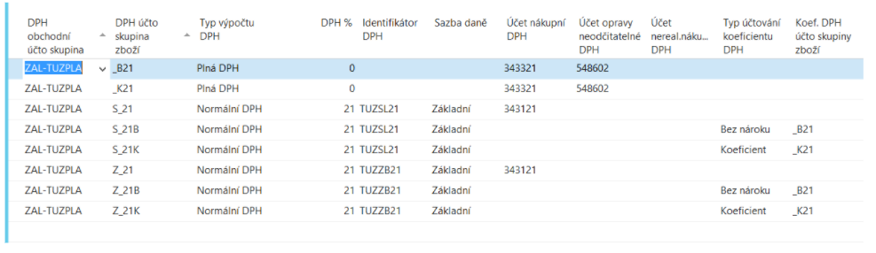
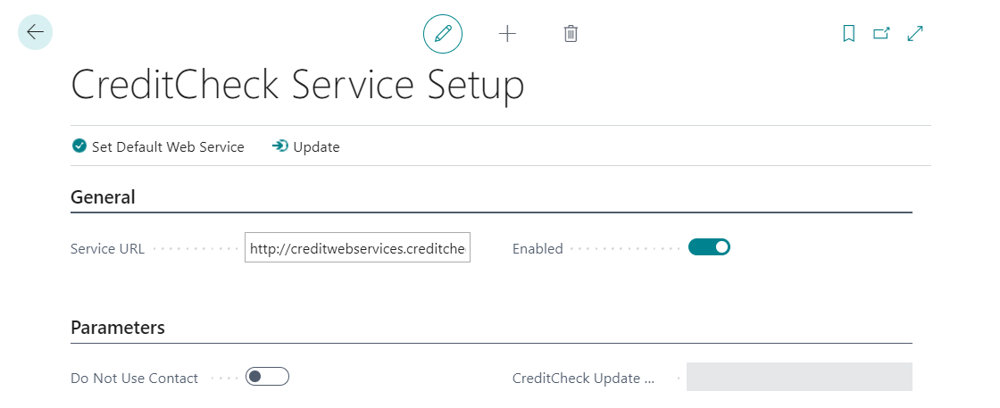
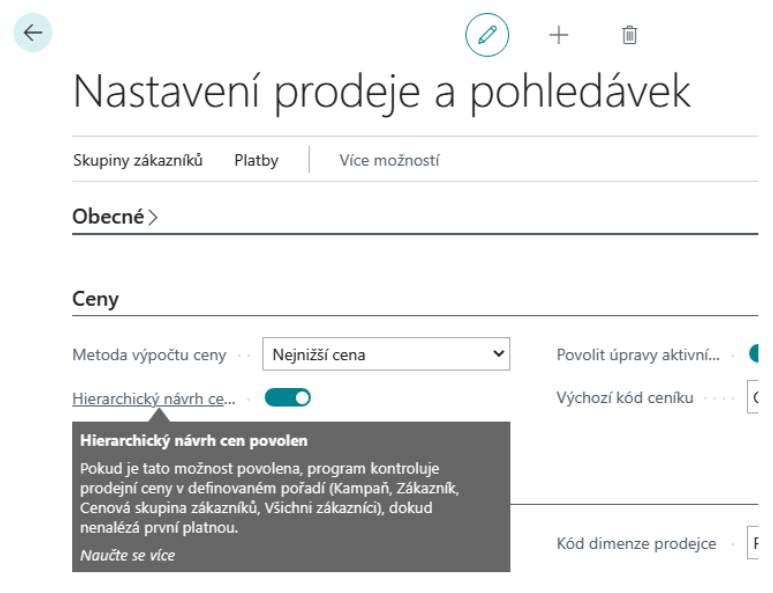
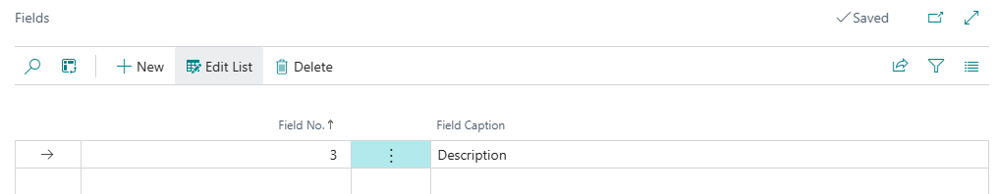
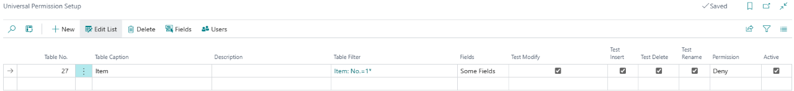

# Application extension set - Settings

> Update: 31.01.2026

## VAT extensions setup

### Setup of VAT registration on documents

In General ledger setup, a date formula is entered that the system uses (in relation to the work date) to define the period in which it notifies the user of outdated VAT registration information. If the VAT ID Check Date Formula field on documents is not filled in, notification is turned off.

1. Choose the  icon, enter **General Ledger Setup** and then choose the related link.
2. On the General ledger setup page, on the Other tab, set the **VAT ID check date formula field on documents**.

### VAT deduct reduction setting

#### VAT Posting Setup

1. Choose the  icon, enter **VAT Posting Setup** and then choose the related link.

For combinations of VAT account groups, where the reduction of the input VAT coefficient will be solved, it must be set (among other things):

- VAT Coeff. Posting Type
- VAT Prod. Posting Group Coefficient

In addition, new combinations of the same VAT business account group and VAT account of the goods group defined in the field "Coef.DPH account of the goods group" (see above) must be set with VAT calculation type = Full VAT

The following must be set for these combinations (among other things):

- "Non Deduction VAT Correction Account" – used as a counter-account of the current VAT purchasing account when re-accounting for the reduction of the VAT deduction by the coefficient.

> [!NOTE]
> The set combinations of VAT account groups with VAT calculation type = Full VAT do not enter the VAT statement.

#### VAT Advance Coefficient

1. Choose the  icon, enter **General Ledger Setup** and then choose the related link.
2. In the VAT Advance Coefficient field on the VAT tab, set the percentage value valid for the current accounting period.

### VAT registration in multiple countries setup

#### More VAT registration numbers of customers

1. Choose the  icon, enter **Customers** and then choose the related link.
2. Select the Registration Country action.
3. Enter the country code and VAT registration number.
4. Next, add VAT Bus.Posting Group to be used in the event of a sale to a customer in that country.

#### More VAT registration numbers of vendors

1. Choose the  icon, enter **Vendors** and then choose the related link.
2. Select the Registration Country action.
3. Enter the country code and VAT registration number.
4. Next, add VAT Bus.Posting Group to be used in the event of a sale to a customer in that country.

#### More VAT registrations

The basic setting consists in the recording of VAT registration numbers in individual countries and setting how the system should change the VAT Bus. Posting Group in documents for the correct processing of VAT entries when concluding VAT and for the correct creation of documentation (most often for accounting offices in these countries).

1. Choose the  icon, enter **Company Information** and then choose the related link.
2. Select the Registration Country action.
3. On the Registration Country/Region page, enter the country code and VAT reg. number of the company registered in this country. For the created record, fill in the Currency Code (local) specifying the currency in which the VAT return is filed in the selected country.
4. Close the Registration Country/Region page.
5. Select the Registration Country/Region Routes action.
6. On the Registration Country/Region Routes page, define how the system should replace the VAT Business Posting Group on the documents.

In the case of using a currency other than the local currency in the country of registration, it is necessary to maintain exchange rates between the currency of the document and the local currency of the country of registration.

1. Choose the  icon, enter **Currencies** and then choose the related link.
2. Select the Registration Country Exch. Rates action.
3. Enter the date and exchange rate on the Reg. Country Curr. Exch. Rate page.

> [!NOTE]
> The system does not include functionality for importing Registration Country Exch. Rates.

#### OSS – EU regime

1. Choose the  icon, enter **General Ledger Setup** and then choose the related link.
2. In the OSS - EU Registration field on the VAT tab, confirm that your company is registered for OSS mode.
3. In the Currency code for OSS field on the VAT tab, select the currency code corresponding to the Euro currency.
4. Select the VAT Settings for OSS action (Related -> VAT Posting).
5. On the VAT Settings for OSS page, enter the VAT sales group for the combination of countries where the shipment starts and ends, and select whether the document should be marked as OSS for this combination.

>[!NOTE]
>Combinations with the OSS = No flag must be defined for cases when it is necessary to disable the OSS mode on a sales document.

### Set up purchase advance overpayment posting

The described automation when posting the final invoice is turned on in the VAT posting settings for selected combinations of posting groups. If this behavior is appropriate only for certain cases, you need a specific VAT group (item) defined for them.

1. Choose the  icon, enter **VAT Posting Setup** and then choose the related link.
2. On the VAT posting setup page, find the record for which you want to turn it on and choose the Edit feature.
3. On the VAT Posting Setup Card page, set the Intended to return the deposit flag.

## CREDITCHECK settings

### CreditCheck settings

1. Choose the  icon, enter **CreditCheck Settings** and then choose the related link.
2. Start the **Set Default Web Service** feature, which populates the service URL.
3. Use the **Enabled** button to start the service.

> If your company does not use [Contacts], you must turn on **Do not use contacts for CreditCheck**. Then, when downloading data from CrediCheck, the fields "**CreditCheck status**" on the customer's card will be filled directly.

### Update creditworthiness information

You can update manually as needed or let the system update at regular intervals.

To set up automatically, follow these steps:

1. Choose the  icon, enter **CreditCheck Settings** and then choose the related link.
2. Set the **Automatic Update** flag.

> [!NOTE]
> The created job queue entry is set to run at 6:00 AM on weekdays by default.

To perform a manual update, use the CreditCheck Status Update feature as follows:

1. Choose the  icon, enter **CreditCheck Status Update** and then choose the related link.
2. Press Ok to start the service.

### User setup

In the user settings on the General tab, there is a new boolean **Allow change of CreditCheck status**, which, if the user has it checked, then allows him to cancel the imported status.

### Web resources settings and updates

In the CreditCheck settings, it is possible to turn on the update of web feed creation for all contacts with a completed ID.

1. Choose the  icon, enter **CreditCheck Settings** and then choose the related link.
2. Choose **Auto flag. web resource updates**.

> [!NOTE]
> Creating web feeds for a paid statement is possible using **Aut. update web feeds - Full**, but only if the **Access code** field is filled.
> [!NOTE]
> The created job queue entry is set to run at 6:00 AM on weekdays by default.

## Setting the Hierarchy proposal of sales prices

### Price Calculation Methods (from version 22.0, optionally from 18.0)

Starting with version Business Central version 22 (or Business Central version 18 if you have "Feature Update: New Sales Price Experience" turned on in Feature Management), you turn on hierarchical item price suggestions as follows:

1. Choose the  icon, enter **Price Calculation Methods** and then choose the related link.
2. Click to select the Lowest Price method.
3. In the Sales Price Calculation section, for Items, select the implementation named Financial Pack - Hierarchic (by clicking a value in the Implementation Used field)

### Sales and receivables setup (up to version 21.0)

1. Choose the  icon, enter **Sales & Receivables Setup** and then choose the related link.

> [!TIP]
> The settings depend on the version you are using. In Business Central version 17, select **Hierarchical pricing enabled** to enable it.
>
> [!TIP]
> From Business Central version 18 onwards, we recommend using the brand new pricing functionality in BC.
> Choose the  icon, enter **Function Management** and then choose the related link. Verify that you have the **Feature Updates: New Sales Pricing Experience feature** enabled for all users.

## Payment cumulation settings

### Vendor settings for payment accumulation

1. Choose the  icon, enter **Vendors** and then choose the related link.
2. Open the vendor card for which you want to allow payment cumulation.
3. On the Vendor Card page, on the Payments tab, set **Cumulate Payments**.

Setting the accumulation parameters on the bank account

1. Choose the  icon, enter **Banks** and then choose the related link.
2. Open the bank account tab for which you want to set up payment cumulation.
3. On the Bank Account Card page, in the Payment Orders / Bank Statements tab, set the cumulation of payments as required.

### Payment cumulation settings options

- **Cumulate payment orders field** – enables / disables cumulation
- Field **Cumulate export according to variable symbol** – cumulation after VS
- Field **Cumulate export according to constant symbol** – accumulates for KS
- Field **Cumulate export according to specific symbol** – accumulates after SS
- **Variable symbol number series field** – if it is not accumulated according to VS, KS or SS, then the number according to the number series set here is added to the VS field (SS and KS are taken from the first merged line of the command)
- Field **Description of the accumulated payment order line** – description for the created cumulative line

## Exchange rate controls settings

### Checking for correctness when entering the exchange rate

The upper and lower limits of the value in the local currency can be set for each foreign currency defined in the system. This is especially advantageous for less used currencies, where there is an even greater risk of user error when entering the exchange rate on the document, etc. If the field with the currency limit is empty, the check is not performed.

1. Choose the  icon, enter **Currencies** and then choose the related link.
2. Run the **Edit** action.
3. On the Currency tab page, on the General tab, set the **Rel.Exch.Rate Amt.  Upper Limit** and **Rel.Exch.Rate Amt. Lower Limit** fields.

### Checking for the existence of an exchange rate

In the Finance settings, you enter the date formula that the system will use (in relation to the settlement date) to define the period in which it notifies the user that there is no entry in the exchange rate table.  If the Ex.Rate Check DateForm. on Doc is not fulfiled, the notification is turned off.

1. Choose the  icon, enter **General Ledger Setup** and then choose the related link.
2. Run the **Edit** action.
3. On the Finance Settings page, set the **Ex.Rate Check DateForm. on Doc** field.

> [!NOTE]
> "-1D" is usually set for daily exchange rates.

## Enforcement of receivables - settings

### Enforcement methods

Specific types of recovery can be set using the Enforcement Methods:

1. Choose the  icon, enter **Enforcement Methods** and then choose the related link.
2. On the Enforcement Methods page, enter the code for the new record (eg "FACTORING" to distinguish the reason for the claim). You can also add a more detailed description in the Description field.

## Setup of number series extensions

### Number series mask settings

A new field for the number series mask structure has been added to the number series table, where the user defines the positional structure of the number generated in this number series. This feature makes it easier to create new number series for a new fiscal year and reduces errors.

1. Choose the  icon, enter **No. Series** and then choose the related link.
2. In the **Mask**, set the combination of fixed and wildcards in the format "**XXrrcccc**".
   - XX - fixed part of the number; must be in capital letters, length is not limited (only the total length of the final number).
   - yyyy (or yyyy) - year designation, which is completed by the generator from the specified start date.
   - cccc - variable part of a number; must be lowercase, length is not limited (only the total length of the final number)

> [!TIP]
> If you set the mask "BVY1rrcccccc", then the generator started with the starting date 1.1.2021 will create No. series Line, where the Starting No. will be "BVY121000001" and the Ending No. will be "BVY121999999".

### Number Series Links Setup

A new No. Series Link table has been added.

1. Choose the  icon, enter **No. Series** and then choose the related link.
2. Select the **Links** action.
3. Fill in one of the columns according to the number series:

   - **Linked No. Series** – which number series is to be used in the connected activity, when the source document has a specified number series: order created from demand, order created from bulk order

   - **Posting No. Series** – which number range is to be used for the posted document when the source document has the specified number range: posted sales / purchase / service document (invoice, credit memo), issued reminder, issued penalties, charged delivery / warehouse receipt, posted assembly order, posted inventory receipt / issue, posted physical inventory volume

   - **Shiping No. Series** – which number series is to be used for the posted delivery when the source document has the specified number range: billed sales delivery from the sales order or invoice, transfer delivery from the transfer order

   - **Receiving No. Series** – which number range is to be used for the posted receipt when the source document has the specified number range: charged purchase receipt from the purchase order or invoice, transfer receipt from the transfer order.

   - **Shiping Wh. No. Series** – which number range is to be used for delivery from the warehouse when the source document has the specified number range: delivery from the warehouse from the sales / purchase / transfer order.

   - **Receiving Wh. No. Series** – which number series is to be used for the warehouse receipt when the source document has the specified number series: warehouse receipt from the sales / purchase / transfer order

> [!TIP]
> The Number Series Links (posting, shipping and receiving) are taken into account even when using a manual number on a sales or purchase document. The system will complete them according to the settings for the number series specified in Sales Settings or Purchase Settings.

## Rounding setup according to the method of payment

Rounding settings are made differently depending on the currency, as is the case with other similar parameters:

**Local currency setup**  

1. Choose the  icon, enter **General Ledger Setup** and then choose the related link.
2. Select the Invoice Rounding Settings action.
3. On the Invoice Rounding Setup page, define the rounding settings for all payment methods that should be set differently than the default from General ledger Setup.

> [!NOTE]
> The view is filtered to an empty currency code.

**Foreign currency setup**  

1. Choose the  icon, enter **Payment Method** and then choose the related link.
2. Select the Invoice Rounding Settings action.
3. On the Invoice Rounding Settings page, define the rounding settings for foreign currencies in combination with the selected payment method, for which the settings should be different from the default on the Currency Card.

## Universal Permission Setup  

First, you need to enable the Universal Permissions feature:

1. Choose the  icon, enter **General Ledger Setup** and then choose the related link.
2. On the **General Ledger Setup** page, on the Application Extension Set From Aricoma FastTab, choose the **Universal Permission Allowed** check box.

Use the following procedure to set up special access to the table for selected users:

1. Choose the  icon, enter **Universal Permissions Settings**, nd then choose the related link.
2. On the **Universal Permissions Settings** page, insert a new row and select the value corresponding to the entity for which you want to set permissions in the **Table Number** field.

3. In the **Description** field, enter any text, such as who and what the permission applies to.
4. Click on the row in the **Table filter** field to enter a filter that determines for which records or table values you want to set the permission. A new window will open where you can fill in the **Field number**. Enter the desired filter in the **Field filter** field.

5. Return to the **Universal Permissions Settings** page. If you want the permission to apply to all fields in the table, select "All fields" in the **Field** field.
If you want the permission to apply only to certain fields, select "Some fields," run the *Field* action, and select the desired fields to be checked on the page that opens.

6. Return to the **Universal Permissions Settings** page and set the scope of permissions. Check the **Test Modify**, **Test Insert**, **Test Delete**, or **Test Rename** boxes as needed.
7. By launching the *Users* action, you can set up individual users for whom the permissions are to apply.
8. In the **Permission** field, select "Allow" if you want to allow the selected users to perform the specified operations on the fields specified above. By selecting "Deny," you will deny the selected users from performing the selected operations on the selected fields.
9. In the last field, **Active**, you can activate or deactivate the settings in the row.

## See also

[Application extension set](app-extension-set.md)  
[Financial Pack](finance-pack.md)
