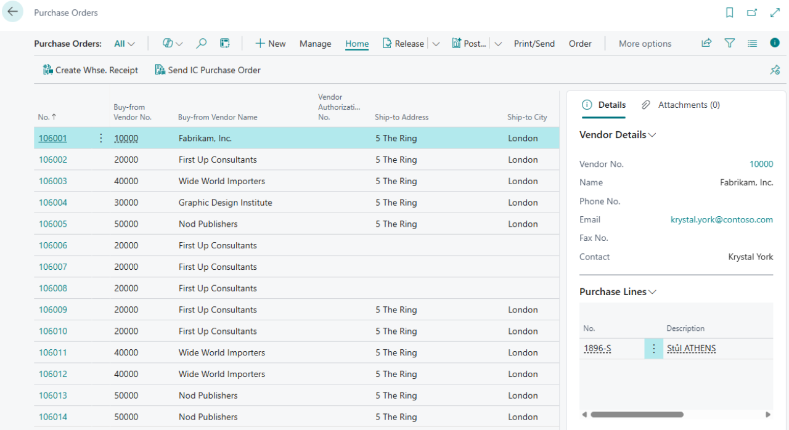
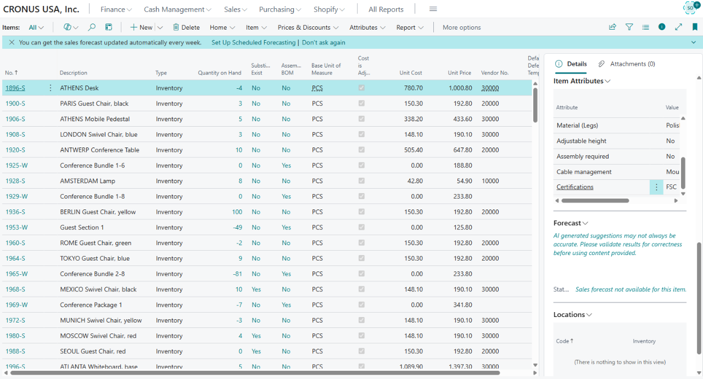
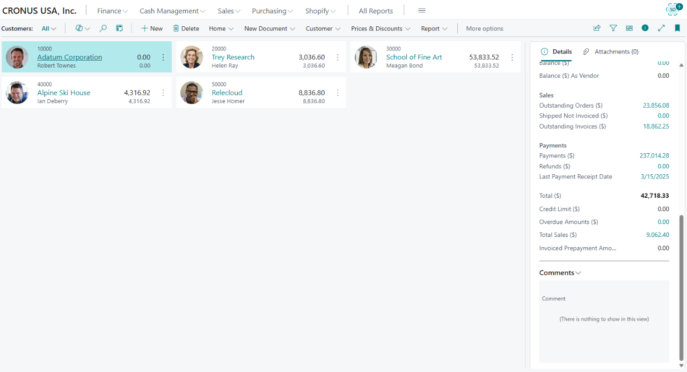

# Business Pack

> Update: 1.7.2025

**Business Pack** extends Microsoft Dynamics 365 Business Central with practical, frequently used fields and clear factboxes directly on key system pages. It provides users with immediate access to essential information without the need for manual setup, code changes, or custom development. All relevant data is displayed automatically exactly where it's needed.

The module focuses exclusively on enriching existing tables and pages with helpful information that simplifies daily work, improves clarity, and enhances system navigation. The result is time savings and reduced error rates.

Business Pack is an ideal solution for companies that want to harness the full potential of Business Central without complex modifications or expensive development.

> [!NOTE]
> All fields and factboxes are **automatically activated** and visible on the relevant pages upon installation.

## Added Fields

The extension includes clearly structured fields on the following pages:

### Sales Documents

- **Sales Orders**: recipient's address and city, promised delivery date, payment method code, company ID (IČO), VAT ID (DIČ), inventory shipment status.
- **Posted Sales Shipments**: original order number, recipient's address and city, related invoices.
- **Posted Sales Invoices**: recipient's address and city, payment method code, list of related shipments.

### Purchase Documents

- **Purchase Orders**: recipient's address and city, vendor order number, promised receipt date, company ID (IČO), VAT ID (DIČ).
- **Warehouse Shipments / Warehouse Receipts**: customer number and name, recipient's address, order number, and other logistics details.

### Transfer Documents

Efficient warehouse transfer management requires accurate and accessible data right where users need it. Business Pack enriches transfer document lines with key fields – **item number**, **description**, **quantity**, and **unit of measure**.

These additions provide a better overview of each transfer's content, improve control over operations, and help reduce errors when handling goods. Information that previously required navigating to other pages or manual lookup is now instantly available in context.

### Item Card

Displays a summary overview: item number, type, note, assembly BOM, inventory levels, reservations, available quantity, items in transit, ordered and delivered quantities, invoicing status.

## New FactBoxes

Business Pack introduces new factboxes that enhance visibility and reduce time spent searching for data. They are placed on key pages such as:

- **Sales and Purchase Orders**
- **Invoices and Shipments**
- **Item Cards**

### “Inventory by Location” FactBox

Displays which warehouse locations hold the item and in what quantity. Accessible from the item list and the item card.

### Document Line FactBoxes

Allow users to view line details (item number, description, quantity, unit of measure) directly on sales and purchase order pages.

### Note FactBoxes

- **Customer Notes**: visible on Customer List and Customer Card, as well as on sales orders, invoices, and returns.
- **Document and Shipment Notes**: ensure that important internal notes are always within reach.

## Summary

Business Pack brings more context, greater efficiency, and faster navigation in Microsoft Dynamics 365 Business Central – with no code, no development, and no compromises.

## See also

[ARICOMA Solutions](solutions.md)  
[Streamline Tools](streamlinetools.md)
