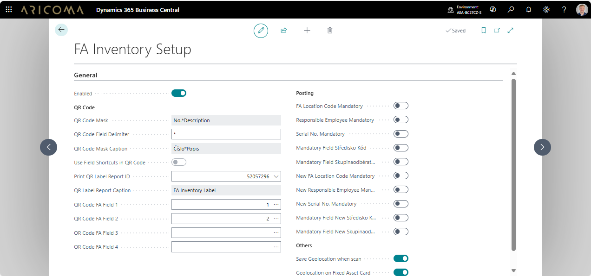

# Fixed Assets Inventory — Setup

The **Fixed Assets Inventory** application needs to be set up according to the following description.

## Fixed Assets Inventory Setup

- Choose the  icon, enter **Fixed Assets Inventory Setup**, and then choose the related link.  
- On the **Fixed Assets Inventory Setup** page, you can:
  - define the QR code structure – **Field 1 .. 4 FA for QR Code**.
  - report for QR code printing.
  - force filling of fields in the **Posting** section when posting.  
  - Set automatic GPS location saving when scanning - **Other** section.

  

## Fixed Assets Inventory Journal Templates Setup

- Choose the  icon, enter **Fixed Assets Inventory Journal Templates**, and then choose the related link.  
- On the **Fixed Assets Inventory Journal Templates** page, you need to create parameterization.  
- On the **Fixed Assets Inventory Journal Templates** page through **Related/Template/Batches** action, you can create individual batches for fixed assets inventory, e.g., for individual cost centers, locations, responsible employees, ...

## Online Maps Setup

- Choose the  icon, enter **Online Maps Setup**, and then choose the related link.  
- On the **Online Maps Setup** page, create parameterization:
  - **Enabled** – enable this functionality.  
  - **Map Parameter Setup Code** – choose on which map the coordinates will be displayed.  

## Related information

[Fixed Assets Inventory](fa-inventory.md)  
[ARICOMA Solutions](solutions.md)  
