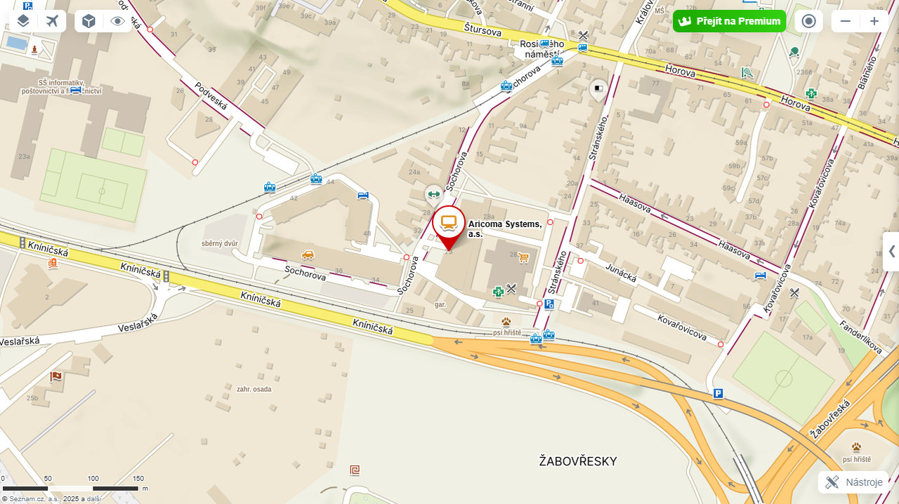

# Fixed Assets Inventory

The **Fixed Assets Inventory** application is used for physical inventory of fixed assets in [!INCLUDE [d365fin_long_md](../includes/d365fin_long_md.md)] system using **QR codes**.

No more chaotic spreadsheets, lost papers or endless searching for assets. It brings an efficient inventory solution using QR codes and mobile devices that combines simplicity, accuracy and time savings. With fixed assets inventory using QR codes, you get:

## Solution Benefits

- **Speed and efficiency** – Just scan the code or add a note to it and you have the basis of the inventory ready.
- **Data accuracy** – Minimal error rate thanks to automatic asset identification.
- **Online overview** – Asset data available anytime and anywhere.  
- **Easy change management** – Change of location, cost center or responsible person? Just a few clicks.
- **Ecological solution** – No paperwork, everything digital.

## How the inventory works

**1. Inventory preparation on computer**  
    - User creates an **inventory journal** in the system.  
    - Defines and prints QR codes that are attached to assets.  

**2. Field inventory processing (mobile / scanner)**  
    - Just **scan the QR code** of the asset – the system immediately identifies the item.
    - You can **add notes**, e.g. suggestions for changing location, serial number or responsible person.  
    - **GPS location** is automatically saved, which helps to make the records more accurate.  
    - Thanks to map display, you can **navigate to the last known location of the asset**.  

**3. Completing the inventory in the office**  
    - The system processes requests for changes (e.g. new location code, cost center, employee).  
    - You can also perform **"desk inventory"** – e.g. where there is no access to the asset.  
    - The inventory is approved and posted.  
    - Outputs can be **printed** or **published to SharePoint** for further use.  

### Why choose fixed assets inventory using QR codes

- **Time savings** and error elimination.  
- **Precise asset localization** thanks to GPS.  
- **Full mobility** – inventory from anywhere.  
- **Immediate change records** without manual rewriting.  

### Fixed Assets Inventory – preparation (on computer)

**Preparation and generation of inventory journals for individual cost centers, locations, employees (on individual journal batches).**

- Choose the  icon, enter FA Inventory Journal and then choose the related link.  
- On the FA Inventory Journal page, select or create a new Batch Name. To create a new batch, select the New action.  

- On the **FA Inventory Journal** page, select Actions/Functions **Calculate Asset Inventory.**  

The **Calculate FA Inventory** action contains these fields:

- **Posting Date** – date for which we will perform the inventory.
- **Document No.** – document number with which we want to post the inventory.
- **Depreciation Book Code** – select the depreciation book from which you want to select assets.
- **Filter** – filtering assets for inventory.
- **No.** – select asset numbers you want to inventory.
- **FA Location Code** – select the location where you want to inventory assets.
- **Responsible Employee** – select the employee whose assets you want to inventory.
- **Cost Center Code (Global Dimension 1)** – select the cost center where you want to inventory assets.
- **Job Code (Global Dimension 2)** – select the job for which you want to inventory assets.

**Printing labels or inventory reports for manual processing (supplementary processing method).**

- Choose the  icon, enter **FA Inventory Label** and then choose the related link.
- Choose the  icon, enter **FA Inventory Journal** and then choose the related link.
- On the **FA Inventory Journal** page, select Actions/Posting **FA Inventory List**. Printing a form for manual inventory processing (supplementary processing method).

### Fixed Assets Inventory – processing (on mobile device)

- On your mobile device, choose the  icon or directly the link to **FA Inventory Journal** (mobile).
- Through the icon in the bottom right corner, you switch to the list of actions above the inventory journal. Through the **Select Journal** action, select the correct inventory list **Batch Name**.
- Using the **Scan** action, you switch to a page where you then load individual QR codes of assets and can optionally add a **Note** to them. It is advisable to define **Notes** in **Standard Text Codes** so that the user does not have to type the entire text. If the asset is not in the inventory journal, the system suggests and automatically creates a new line. If the **Save GPS location automatically when scanning** option is checked in **FA Physical Inventory Setup**, the system automatically saves GPS coordinates when scanning.
- Using the **Online Maps** action, it is possible to display the asset's location on a map or navigate to the asset according to saved **GPS coordinates.**

### Fixed Assets Inventory – manual processing (supplementary processing method)

- Choose the  icon, enter ***FA Inventory Journal*** and then choose the related link.
- On the ***FA Inventory Journal*** page, select the correct inventory list Batch Name.
- According to the completed inventory list (paper document), run the action:
  - Set Checked on All
  - Set Checked on Selected lines of the inventory journal

### Fixed Assets Inventory – completion

#### Performing and posting recorded changes

- Choose the  icon, enter **FA Inventory Journal** and then choose the related link.
- On the **FA Inventory Journal** page, select the correct inventory list **Batch Name**.
- According to the text note **Description** or according to the **Inventory List (paper document)** for the selected asset, fill in the fields:
  - **New FA Location Code**
  - **New Responsible Employee**
  - **New Cost Center** (Global Dimension 1)
  - **New Job** (Global Dimension 2)
  - **New Serial No.**
- On the **FA Inventory Journal** page, select the correct inventory list **Batch Name**.
- Run the **Post** or **Post and Print** action. Posting actions in the inventory journal:
  - performs changes on the asset card:
    - **FA location,**
    - **responsible employee,**
    - **cost center** (Global Dimension 1),
    - **job** (Global Dimension 2),
    - **serial number.**
  - and creates records of performed changes:
    - FA Physical Inventory Entries.
    - FA Inventory Journal.

### Evidence on the asset card

- Choose the  icon, enter **Fixed Asset** and then choose the related link.
- On the **Fixed Asset** page, there are new fields:
  - **Last Inventory Date**
  - **GPS Latitude**
  - **GPS Longitude**

## Related information
[Fixed Assets Inventory - Setup](fa-inventory-setup.md)  
[ARICOMA Solutions](solutions.md)
