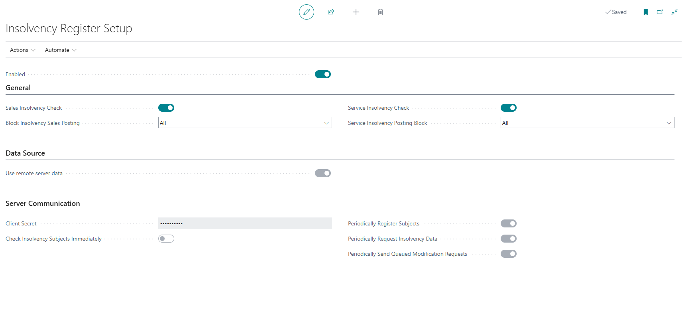
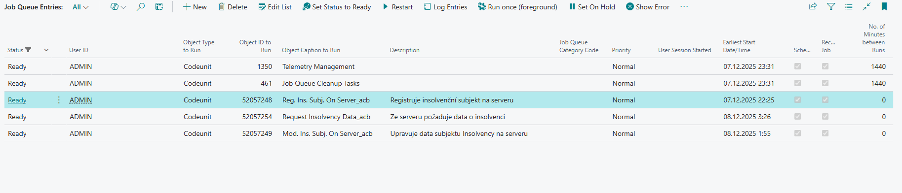

# Insolvency Register Setup

> Update: 30.11.2025

First, you need to properly configure the Insolvency Register module and set up the way data from the Insolvency Register is downloaded to your Business Central database.

## Server Communication Setup (Modern)

The new communication method is available for both **Online** and **On-premises** versions of Business Central. To set it up, you need to contact **ARICOMA** **(bc_sales@aricoma.com)** to obtain an access key.

1. Choose the  icon, enter **Insolvency Register Setup**, then choose the related link.
2. Verify that on the **Data Source** tab, the **Use Data from Remote Server** field is enabled.
3. Enter the value of the access key you received from ARICOMA in the **Secret Key** field.
4. The **Check Insolvency Entities Immediately** field enables immediate checking when making changes to customer/vendor cards.
5. The **Periodically Register Entities** field ensures automatic registration of new customers/vendors to the server. Its setting automatically creates a job queue entry for this purpose.
6. The **Periodically Request Insolvency Data** field ensures regular downloading of current insolvency information from the server. Its setting automatically creates a job queue entry for this purpose.
7. The **Periodically Send Modification Requests** field is used to send pending data modification requests to the server. This field can only be activated when immediate insolvency entity checking is not enabled and is automatically deactivated when immediate checks are turned on. Its setting automatically creates a job queue entry for this purpose.
8. Activate the **Enabled** flag.
9. If **Third Party Terms** appear, read them and confirm your agreement by clicking **I Accept**.
10. Close the page.

**IR Server Communication Schema**  

Each of the periodic tasks creates a record in **Job Queue Entries** where you can monitor their status.

## Communication Setup (Classic)

In the **On-premises** version, you can still use the data download mode to the database. The fundamental difference from the modern method described above is that in this mode, all Insolvency Register data is downloaded to the customer's database (in 2025, the size of IR data in BC is approximately 27GB).

1. Choose the  icon, enter **Insolvency Register Setup**, then choose the related link.
2. Verify that on the **Data Source** tab, the **Use Data from Remote Server** field is **disabled**.
3. The **Set Default Web Service** action can be used to set the web service address to the default state.
4. Check the required download period.
5. Activate the **Enabled** flag.
6. Read the **Third Party Terms** and confirm your agreement by clicking **I Accept**.
7. Close the page.

## Insolvency Check Setup for Sales and Service

1. Choose the  icon, enter **Insolvency Register Setup**, then choose the related link.
2. Activate **Insolvency Check in Sales** to alert users when creating sales documents about the fact that the customer has an insolvency case (open or closed).
3. In the **Block Sales Posting on Insolvency** field, set whether posting of shipments, invoices, or all should be blocked in case of an active Insolvency Proceeding.
4. Activate **Insolvency Check in Service** to alert users when creating service documents about the fact that the customer has an insolvency case (open or closed).
5. In the **Block Service Posting on Insolvency** field, set whether posting of shipments, invoices, or all should be blocked in case of an active Insolvency Proceeding.
6. Close the page.

## User Setup with Permission to Disable Insolvency Check

1. Choose the  icon, enter **User Setup**, then choose the related link.
2. Select the user and set the value in the **Allow Unlock Insolvency Block** field to **Yes**.

## Related Information

[Insolvency Register](insolvence-register.md)  
[ARICOMA Solutions](solutions.md)
