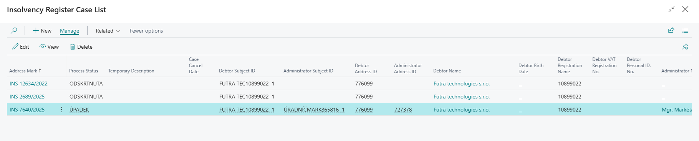
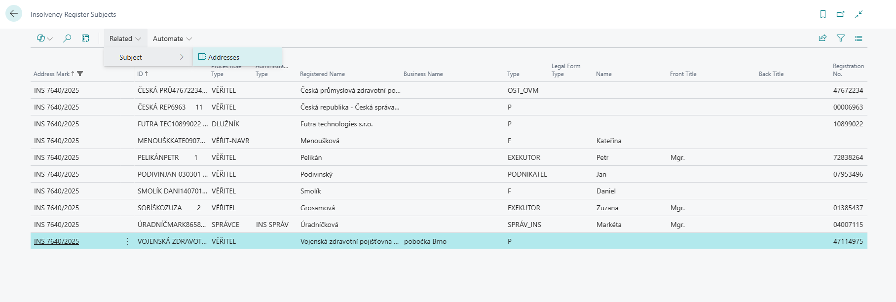
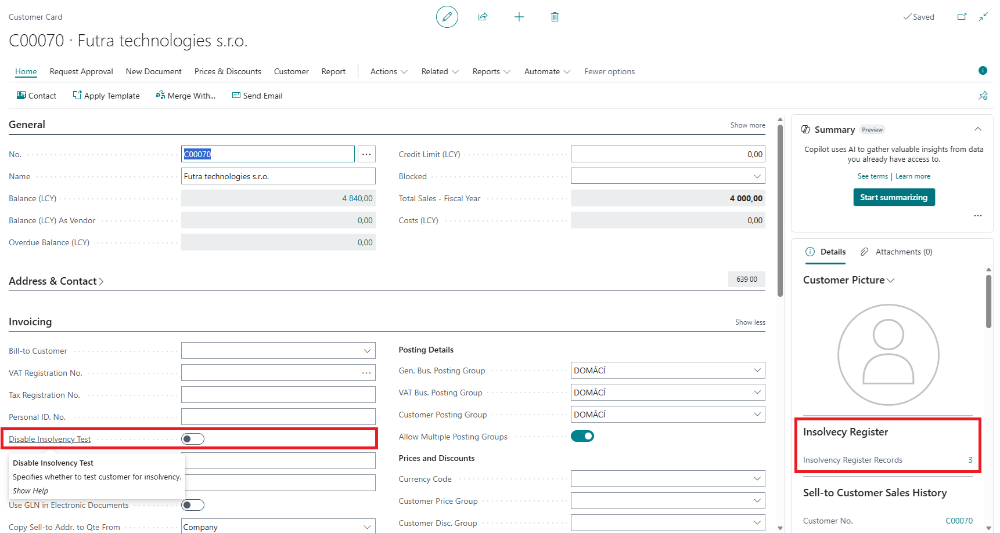
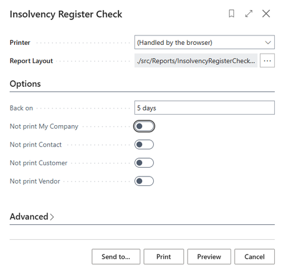
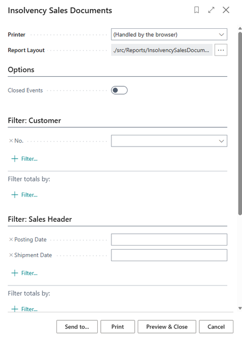
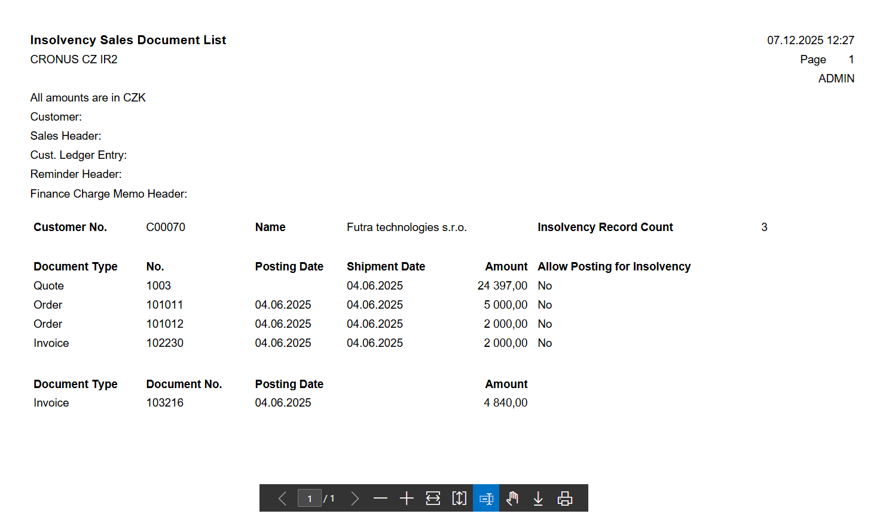

# Insolvency Register

> Update: 30.11.2025

**Insolvency Register** is an extension for Microsoft Dynamics 365 Business Central that enables automatic verification of payment capability of customers and vendors based on data downloaded from the official Insolvency Register of the Czech Republic https://isir.justice.cz. **Insolvency Register (ISIR)** is a publicly available online database managed by the **Ministry of Justice of the Czech Republic**, which records information about insolvency proceedings of natural and legal persons.

The database contains:

- Insolvency court decisions (proceeding commencement, bankruptcy, debt relief, etc.)
- Creditor claim registrations
- Insolvency administrator reports
- Debtor identification data (name, Company ID, date of birth)
- Proceeding file documentation in chronological order

The register is important for:

- **Creditors** – for claim registration
- **Debtors** – for monitoring proceeding progress
- **Entrepreneurs** – for verifying business partners
- **Public** – for verifying financial reliability of persons and companies

Records remain in the register **3 years after proceeding completion**.

**The Insolvency Register application** for Business Central makes this public data available directly in Business Central so that the company has this information directly integrated into business processes. When a company enters a new partner (customer, vendor, contact) with a record in ISIR into the system, or if an existing partner subsequently appears in ISIR, the system user is informed of this fact.

## Key Features

- Display of insolvency proceeding information on customer, vendor, contact cards and Company Information
- User warnings when working with sales or service documents
- Setting to prevent document posting
- Ability to disable insolvency testing for a specific partner (customer, vendor)
- Allow posting during insolvency for a specific document
- Complete information about ongoing and completed insolvency proceedings of partners directly in Business Central

### Cloud Version and Server Architecture

For cloud versions of Business Central, a **server application component** is used, which provides:

- Centralized loading of all records from ISIR (Insolvency Register)
- API provision for queries from the IR client part
- Automatic data synchronization between server and client applications

The server architecture eliminates the need for each Business Central instance to download complete data from ISIR, which significantly increases service performance and reliability.

For **On-Premises versions** of Business Central, you can choose between two implementation methods:

- **Server variant** - uses a centralized server for downloading data from ISIR, same as the cloud version. This variant reduces database size as only data of entities that are recorded in the given Business Central instance as customers, vendors, or contacts are downloaded.
- **Direct download** - complete data is downloaded from ISIR directly to the database of the specific Business Central instance without using a central server. This approach is suitable for organizations that prefer full control over their data and do not use cloud services.

## Usage

### Displaying Partner Insolvency Information

- Choose the  icon, enter **Customers**, then choose the related link.
- Navigate to a customer record with an entry in the insolvency register.
- Choose **Related > Customer > Insolvency Register**. Alternatively, you can use the Insolvency Register FactBox, which displays the number of open Insolvency Register records.
- On the Insolvency Register Cases List page, you can see a list of open and closed customer insolvencies.

The same information is also available on **Vendor** and **Contact** cards. Information about insolvencies against your own organization is available on the **Company Information** page.

#### Insolvency Register Case Card

**The Insolvency Register Case Card** provides a detailed view of a specific insolvency proceeding and serves to:

- **Display complete information** about the insolvency proceeding including file number, commencement date, proceeding status, and proceeding type
- **Track progress** of the insolvency proceeding with a chronological overview of all significant events
- **Identify the subject** - displays complete information about the debtor (name, Company ID, address, legal form)
- **Overview of documents** attached to the insolvency proceeding
- **Monitor changes** in proceeding status over time
- **Access detailed information** about the insolvency administrator and creditors

The card is automatically updated when downloading new data from ISIR and provides users with current information about the development of insolvency proceedings of their business partners.

From the Insolvency Register Case Card, it is also possible to display detailed information about the **subject** of the insolvency proceeding by clicking on **Persons**. For the subject, it is also possible to display address information by clicking on **Addresses**.

### Sales Document Notifications

If **Insolvency Check in Sales** is enabled in **Insolvency Register Setup**, then when inserting a customer on a sales document (quote, order, invoice), if the customer has any record in the insolvency register, a **notification** will be displayed. From it, the user can directly open the **Insolvency Register Cases List**.

### Sales Document Posting Check

When running the Post action on a sales order or invoice, according to the insolvency check in sales settings, a check is performed for **open cases in the insolvency register**. If such a record is found, the user is not allowed to perform posting. In the Insolvency Register Setup, you can specify the **Block Sales Posting on Insolvency** option: **Shipment, Invoice, All, and blank (does not block posting)**.

### Disabling Customer Insolvency Check

A user with special permission can disable insolvency register testing for a customer on the customer card. A side effect is that insolvency records are not displayed for this customer (e.g., the Insolvency Register action on the customer card).

- Choose the  icon, enter **Customers**, then choose the related link.
- Navigate to a customer with a record in the insolvency register.
- On the **Invoicing** tab, enable **Disable Insolvency Test**.
- Verify that the Insolvency Register action displays an empty list. For immediate effect, you need to refresh the page, e.g., with the F5 key.

The same setting is also available on the vendor card (Invoicing tab) and Contact (Foreign Trade tab). In these cases, records about these companies are not displayed in overviews and reports for insolvency register checking.

## One-time Posting Check Disable on Sales and Service Documents

A user with special permission can disable posting restrictions based on the existence of an open insolvency proceeding on a sales document card (or service document). Then the document can be posted.

- Choose the  icon, enter **Sales Orders**, then choose the related link.
- Navigate to an order record for a customer with open insolvency and run the Edit action.
- On the *Shipping and Billing* tab, enable **Allow Posting on Insolvency**.
- Run the Post action.
- Close the page.

### Insolvency Register Check Report

The report automatically alerts about business partner (contact/customer/vendor) entry into insolvency proceedings or about filing an insolvency proceeding proposal against your own company.

- Choose the  icon, enter **Insolvency Register Check**, then choose the related link.
- On the Insolvency Register Check page, define the execution parameters in options:
  - In the **Back by** field, enter for example "5D" to have the system search for records from the last 5 days
  - Use other flags to define whether information about your own company, contacts, customers, or vendors should or should not be printed.
  - Run the report with the **Preview** button.

> [!NOTE]
> You can set up regular user notifications to run the report and resolve issues. This can be set up through **[User Tasks](https://learn.microsoft.com/en-us/dynamics365/business-central/across-user-tasks)**. Another option is to set up **Report Inbox Schedule**.

## Insolvency Sales Documents Report

The report automatically alerts about the existence of documents in the system where the customer has a record in the insolvency register. These are the following documents and entries:

- Sales orders, invoices, quotes
- Reminders, Finance charge memos
- Open customer ledger entries of all types (invoice, payment, credit memo, reminder, finance charge memo)

Running the Insolvency Sales Documents report:

- Choose the  icon, enter **Insolvency Sales Documents**, then choose the related link.
- On the Insolvency Sales Documents page, define in options whether the report should include closed insolvency proceedings.
- Run the report with the **Preview** button.

## Related Information

[Setup - Insolvency Register](insolvence-register-setup.md)  
[ARICOMA Solutions](solutions.md)
