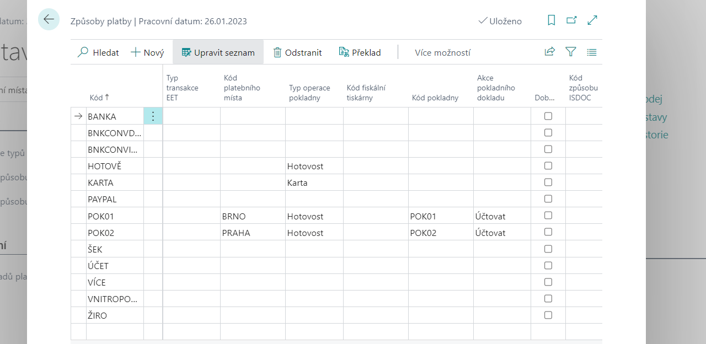

# Setup - Multiple payment methods
> Update 01.04.2022

Before you can use the functionality of multiple payment methods in your business processes, you must make the basic module settings. These are code lists:

- Payment Methods
- Payment places
- User setup

## Payment Methods settings

In the Payment methods list, create codes that represent the payment methods you use (e.g., cash, card, meal vouchers,... according to valid legislation and according to the expected scope of use in the company) so that it is possible to subsequently define the payment by the customer in the required structure.

If there are several counters or branches in the company, it is customary to record operations in these places separately. In this case, it is necessary to define the appropriate number of counter-accounts for each method of payment. The counter-account can be a financial account or a bank account, but the cash register card is most often used.

In addition, the  *Cash Desk Operation Type* needs to be defined for other control mechanisms of the functionality. There must always be a line with the  „Cash“, type, which the system uses when the cash amount received is entered to create the payment schedule line.

When manually creating Payment Schedule rows, the Payment Method Code is filtered by the Payment Location Code assigned to the user (see below).

## Settings up Payment Places

If a company defines payment methods with multiple cash registers, it can be advantageous for the company to name the individual physical cash points and define the users that work on them.

In the Payment places list, define all the locations where customers can pay their obligations to your business. 

In the User Settings list, assign the appropriate payment places code to the selected users serving customers. This assignment will help to guide user behavior to prevent errors due to inattention. See Assigning payment methods to users. **See: Assign payment methods to users.**

By assigning a Payment Location Code to a payment method, you achieve greater control over users so that payment cannot be made by mistake against a balance account that is not assigned to the user. 

## Setting up Multiple Payment Methods

Description of individual parameters:
- **Enable Multiple Cash Operation Types** – allows you to define multiple payment methods with the same cash transaction type and for the same payment location.  It is necessary if you want to allow, for example, to accept foreign currency at POS.
- **Check Payment Method On Sales Documents** – this can be used to set the system to check if the corresponding Payment Method is used (i.e. with the same Payment Point assigned as the one set by the user who initiated the Issue action). If everything is set correctly, the system will change the Payment Method on the document, otherwise the system will display an error message.
- **Check Payment Method On Purchase Documents** dtto, but for purchase documents.
- **Allow EET Register** – enables checking that only rows in the Payment Schedule can be used that have the EET Cash Register Code column set.
- **Check Fiscal Printer** – this setting enables the enforcement of the use of the integration functionality with the so-called Fiscal Printers, their use is mandatory in the legislative environment of the Slovak Republic (see [Fiscal Printers](https://www.aricoma.com/docs/en-us/dynamics365/business-central/FinancialPack/fiscal-printers.html)).

On the Numbering tab, you can set the number series for payment documents. . This will only be used if you use a payment method with a counter-account other than Cashier (cashiers have their own number series, see [Cash Desk Localization for Czech](https://learn.microsoft.com/en-us/dynamics365/business-central/localfunctionality/czech/ui-extensions-cash-desk-localization-cz#setting-up-no-series-for-receipts-and-withdrawals)).

## Assigning payment methods to users

In order to better control the handling of cash or valuables, separate records are usually required for each user. To reduce error rate, each user can be assigned his own Payment Place Code.
1. Choose the  icon, enter **User Setup** and then choose the related link.
2. On the User Settings page, select the desired value in the Payment Point Code column.

## See also

[Multiple payment methods](multiple-payment-methods.md)  
[Financial Pack](finance-pack.md)
