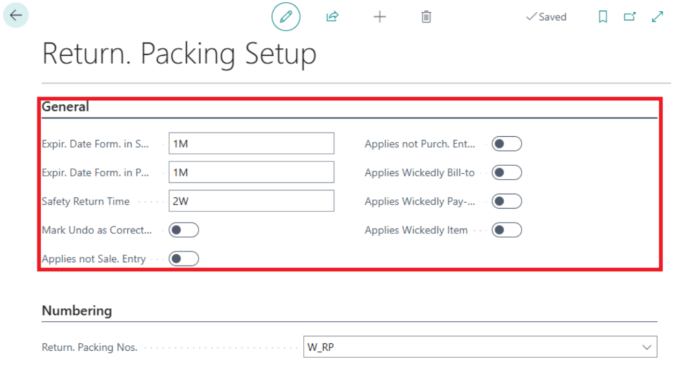
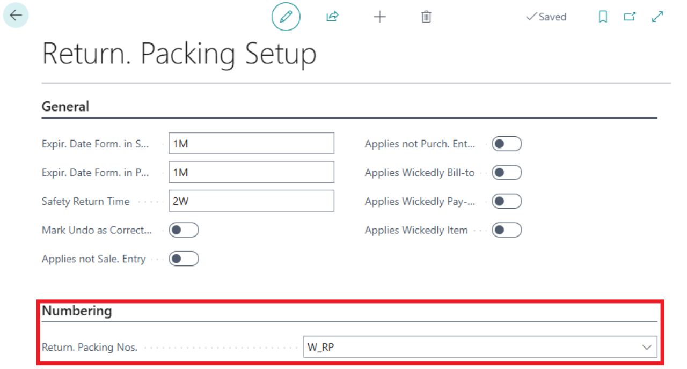
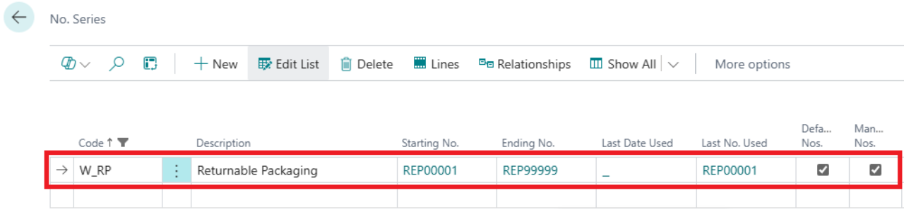
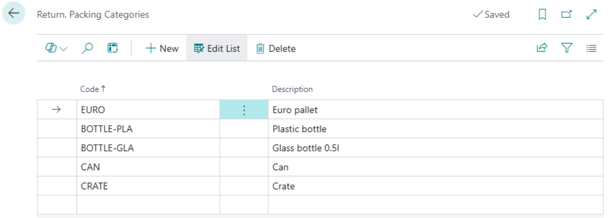
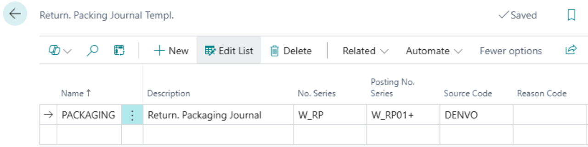
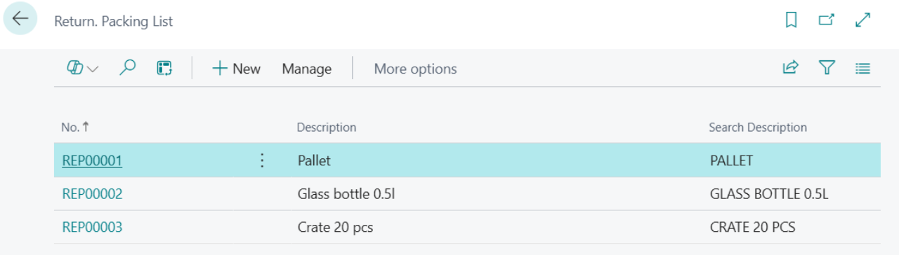
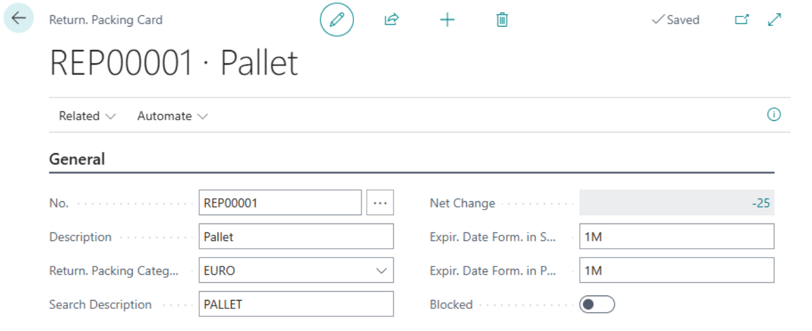

# Returnable Packaging records - Setup
> Update: 01.01.2025

The Returnable Packaging Management module is an extension of the Inventory module. It enables tracking the circulation of returnable packaging and pallet management. The module allows monitoring packaging balances of business partners, linked to relevant business transactions (Purchase, Sale, Positive Adjustment, Negative Adjustment, Transfer, Consumption, and Production) as well as tracking the current value of the packaging.

To ensure the proper functionality of the Returnable Packaging Management module, certain settings must be configured in advance:

- **Configure calculation formulas**
- **Set up No. series**
- **Create returnable packaging categories**
- **Create returnable packaging journal templates**

## Setting Up Expiration Date Formulas and No. Series

1. Select the icon , enter **Return. Packing Setup** and then select the related link.
2. On the **Return. Packing Setup** page, under the **General** tab, you need to configure the relevant formulas, such as **Expir. Date Form. in Sale**, **Expir. Date Form. in Purchase**, and **Safety Return Time**.

The General tab includes the following fields:

- **Expir. Date Form. in Sale** – Enter the period within which the customer is obligated to return the returnable packaging.
- **Expir. Date Form. in Purchase** – Enter the period within which you are obligated to return the returnable packaging to the supplier.
- **Safety Return Time** – This feature allows setting an additional time frame to the standard return period for returnable packaging. After this "safety period" expires, the system will notify you about packaging that was not returned on time.
- **Mark Undo as Correction** - Enables marking undo actions as corrections.
- **Applies not Sale. Entry** – If this option is enabled, automatic reconciliation of returnable packaging entries during crediting (sales) is disabled.
- **Applies not Purch. Entry** – If this option is enabled, automatic reconciliation of returnable packaging entries during crediting (purchases) is disabled.
- **Applies Wickedly Bill-to** – This option sets the reconciliation of returnable packaging entries according to the bill-to customer specified on the sales document. If unchecked, reconciliation is performed based on the customer.
- **Applies Wickedly Pay-to** – This option sets the reconciliation of returnable packaging entries according to the pay-to vendor specified on the purchase document. If unchecked, reconciliation is performed based on the supplier.
- **Applies Wickedly Item** – This option sets the reconciliation of returnable packaging entries according to the item associated with the returnable packaging. If unchecked, reconciliation is performed based on the returnable packaging itself.

3. For proper functionality, it is also necessary to configure the number series for returnable packaging on the **Return. Packing Setup** page under the **Numbering** tab.

4. If you do not have a number series created for returnable packaging, expand the Return. Packing Nos. line, click the New function, and create a new number series.
5. Enter the **Code**, **Description**, **Starting No.**, and **Ending No.** of the number series.
6. Check the **Default Nos.** box to enable automatic number assignment when entering new requests.

## Setting Up Returnable Packaging Categories

The next step is setting up returnable packaging categories. These categories are used for filtering in overview functions and print reports.

1. Select the icon , enter **Return. Packing Categories** and then select the related link.
2. On the **Return. Packing Categories** page, select the **New** action and then enter the **Code** and **Description**.

## Setup of Returnable Packaging Journal Templates

Journal templates are used to predefine journals for accounting for returnable packaging (similar functionality to item journal templates).

1. Select the icon , enter **Return. Packing Journal Templ.** and then select the related link.
2. On the **Returnable Packaging Journal Template** page, select the **New** action and then enter the **Name**, **Description**, **No. Series**, **Posting No. Series**, and **Source Code**.

## Setting Up Returnable Packaging Cards

1. Select the icon , enter **Return. Packing List** and then select the related link.
2. On the **Return. Packing List** page, select the **New** action.

3. After selecting the **New** action, the **Return. Packing Card** opens.

Each **Returnable Packaging Card** contains the following fields:

- **No.** – Select the number series for returnable packaging.
- **Description** – Name of the returnable packaging.
- **Return. Packing Category Code** – Identification of the returnable packaging category.
- **Search Description** - A description used for search purposes.
- **Net Change** – A non-editable field with a link to the "**Return. Packing Ledger Entries**" table. The displayed value indicates the balance status of the returnable packaging.
- **Expir. Date Form. in Sale** – Enter the period within which the customer is obligated to return the returnable packaging.
- **Expir. Date Form. in Purchase** – Enter the period within which you are obligated to return the returnable packaging to the supplier.
- **Blocked** – A field to block (prevent) further use of the specific returnable packaging card.

If specific values are set, they take precedence over general settings.

From the card, you can also use the Related action to view **Return. Packing Ledger Entries** and **Comments**.

**See also**

[Returnable Packaging records](pack-tracking-return-packing.md)  
[Financial Pack](finance-pack.md)
