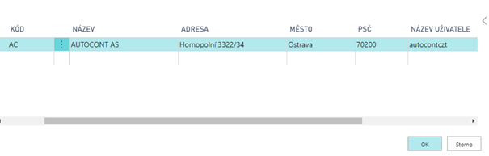
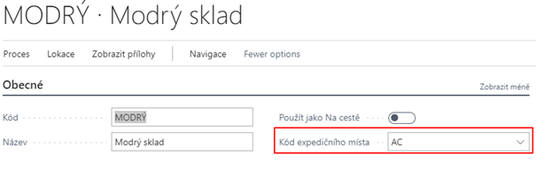
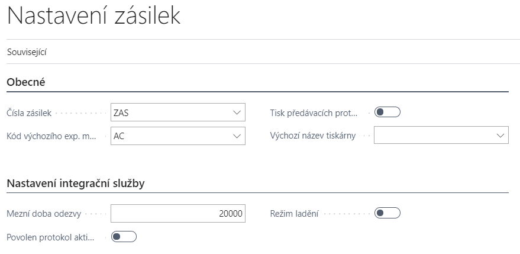
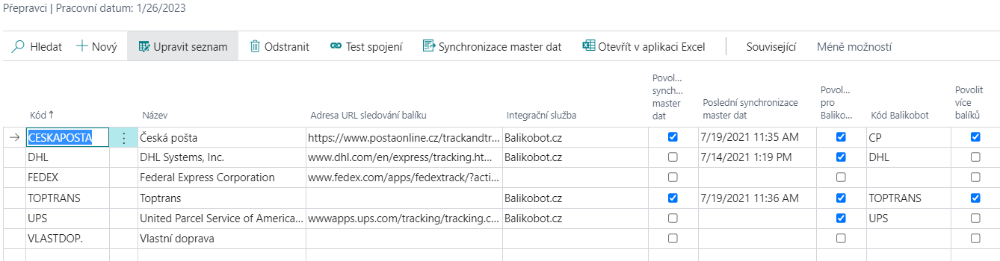

# Setup - Parcels - Balíkobot Integration

> Update: 23.09.2026

There are several areas that need to be set up for the AC Parcel addon to work properly. The addon is initially set up using the wizard and then the settings can be changed manually.

## Addon settings areas

- Numbered series
- Expedition places
- Parcels settings
- Shipping agents
- Location Settings
- Shipment parameters
- Print Settings
- Payment settings (COD)
- Automatic updates
- Settings in the Sandbox environment

Other code lists (Carrier Services, Handling Units and Carrier Branches) are downloaded from the Balíkobot API.

> [!IMPORTANT]
> To prevent users from encountering issues when using Business Central, be sure to configure the module’s permissions before activating its functionality.
> The following permission sets are available upon installation of the module:
>
> |Set Name           |Description                            |
> |-                  |-                                      |
> | PARCELS_READ_ACC  | For read only                         |
> | PARCELS_EDIT_ACC  | For general use                       |
> | PARCELS_SETUP_ACC | For configuring the module’s behavior |
> | PARCELS_ADMIN_ACC | For general use and also configuring  |

## Setting up Parcels using the wizard

1. Choose the  icon, enter **Assisted Setup** and then choose the related link.
2. Select Shipment Settings
3. After reading the instructions, click **Next**.
4. If you want you can import the RapidStart package manually, or you can click **Next and the package will download and import itself**.
5. Next, create a new shipping location using the **New** button and fill in the fields:
   - Code
   - Username
   - Password
6. You can also fill in additional information:
   - Description
   - Name
   - Address
   - City
   - Postcode
7. In the **Expedition Places**, select the newly created record.
8. In the next step, select the location created by the shipping location and click Next.
9. Create a new Shipping Agent using the fields:
   - Code
   - Name
   - Integration services: Balíkobot.cz
   - Balíkobot code
   - Allow multiple packages - YES
   - Master data synchronization - YES
10. Select the **Synchronize master data**function.
11. In the Number Series field, select the appropriate number series for shipments.
12. Once you have filled in everything and clicked **Finish**, the assisted guide will close and the master data will begin to synchronize.

## Manual adjustment of settings

### Expedition places

The Expedition Places are locations of your warehouses from where shipments are dispatched. A user can have several expedition places. A different API is required for each expedition place, and the expedition place is associated with one location of your company.

1. Choose the  icon, enter **Expedition Places** and then choose the related link.
2. Choose the function **New**.
3. Insert **Code** for expedition place, description, address and **User Name and password** to yours API.
4. Close the list of Expedition places.

### Location Settings

On the tab of the given location it is necessary to select the dispatch place that is connected with the given API. If there are more locations, it is necessary to set the appropriate dispatch point for each. This serves to reduce the error rate of users so that they cannot combine documents with different shipping points into the shipment.

To assign a shipping location to a location, you need to set the **Expedition Places Code**.

1. Choose the  icon, enter **Locations** and then choose the related link.
2. Open the desired location tab
3. Fill in **Expedition Places Code** field on the General tab

### Parcels settings

Basic Package Setup must be made on the **Parcels Settings**page.

Parcels Management Setup page contains:

- **Parcels No.** - Specifies the No. Series for parcels.
- **Default Expediton Place Code** - Specifies the API credentials and shipment location from where the parcel will be shipped.
- **Print Handover After Order** – Automatic print of Handover protocols after collection order.
- **Default Printer Name** – Specifies the printer for printing labels
- **Limit Response Time** – Specifies the timeout of communication.
- **Activity Log Enabled** - Starts activity log tracking.
- **Debug Mode** – Allows you to intercept messages in communication with the service
- **Automatic master data synchronization** - Runs a procedure on the job queue that updates all data from the Package in a certain time period.
- **Automatic Transportation Status Update** - Runs a procedure on the job queue that updates the shipment transfer status for the last month in a specific time period.

Basic settings are made using the application setup wizard.
The other tables are downloaded and filled after master data synchronization is enabled.
These data are updated manually using the "Resynchronize master data" function.

#### Basic settings of Parcels - Balíkobot integration

To start the balíkobot functions, you need to make the following settings:

1. Choose the  icon, enter **Parcels setup** and then choose the related link.
2. Select a number series for shipments
3. Select default Expedition Places
4. Enable or disable automatic printing of collection reports
5. Enable or disable Activity Log

### Shipping Agents setup

The basic codebook is loaded using the RapidStart package for Business Central. This package contains data that is not downloaded from the Balíkobot API:

#### Table of Shipping Agents

Other tables are downloaded and filled after synchronization of master data and in the Shipping Agent table.
The update of this data is done manually using the "Resynchronization of master data" function.

The overview also includes carriers that you do not have configured with Balíkobot. Additional data is not imported for such data (see below).

### On the carrier overview, there are several fields to set up

- Integration Service**Integrační služba** – Determines through which integration service the shipping agent is used (in this case Balikobot.cz)
- **Enable master data synchronization** – Master data may become available after switching on
- **Last master data synchronization** – Date of last master data synchronization
- **Enabled for Balíkobot** - Carrier is enabled and can be used
- **Allow multiple packages** - When creating a shipment, the feature allows you to create multiple packages within one shipment.
- **Pallet transport**
- **Number of handling units** - For pallet transport it is possible to set more handling units.
- **Branch only** – Specifies that the carrier serves only as a pickup point.
- **Maximum address length** – set the address length for the selected carrier.

### Functions over shipping agents

- **Connection Test** – Test communication between the integration service and Business Central
- **Master data synchronization** – Starts master data synchronization
- **Shipping Agent Services** - Table of services of individual shipping agent
- **Shipping Agent Branches** - Table of locations, where customers can take goods from the carrier
- **Handling units** - Table of pallet handling units
- **ADR units of the carrier** – Table of ADR units of the carrier

If you add a carrier after the first setup has been made using assisted setup, you must fill in the fields correctly:

- Code
- Package Tracking URL
- Integration service
- Balíkobot code

Then you need to use **the Synronization function of master data**!

### Set up Shipping Agent Services

Shipping Agent Services are downloaded automatically using the Balikobot API. It is possible to force certain settings for individual Shipping Agents services. To set it up, you must:

1. Choose the  icon, enter **Shipping Agents** and then choose the related link.
2. Select the desired carrier from the list and select **Shipping Agent Services** feature
3. Fill in the fields on the following page as needed:
   - **Enabled for Balikobot** - The service can be used (enabled by default)
   - **Enforce Shipment Weight**
   - **Force shipment volume**
   - **Enforce Shipment Price**
   - **Force cash on delivery**
   - **Enforce shipment variable symbol**
   - **Weight on line** - Weight must be filled in the shipment line
   - **Services of ČP** – [Only for Czech Post service](https://www.balikobot.cz/dokumentace/cp_ciselnik_sluzeb.pdf) - a long text string of postal services above the parcel

### Balikobot API settings

This system table allows you to configure extended carrier settings. These are settings for API communication, where you can select communication versions and more for selected carriers.

From an admin point of view, there is an option to set the shipping agent code for communication in case of changes from Balíkobot (Shipping Agent API Code) when the API shipper name is longer than 10 characters (for example DHL Freight EuroConnect, which had the API name "dhlfreight" and now uses "dhlfreightec").

## Shipment parameters

Parameters for individual shipping agents are downloaded from the package package API

### Payment method settings - Cash on delivery

To set up and use the cash on delivery function, it is necessary to set up booeal **Cash on delivery** on the payment method.

1. Choose the  icon, enter **Payment Method** and then choose the related link.
2. In the overview, check the **Cash on delivery** option.
3. Close the payment method overview.

## Print Settings

### PDF reader

You need to have a PDF reader installed to print labels. To work with labels, we recommend Foxit pdf and also have it set as the default program for PDF files.

### Print Format Selection - Client Zone

The basic step in setting up label printing is to define how the PDF with labels will be generated by Package. In the client zone (`https://client.balikobot.cz/`), the user must set whether to print in full page format or according to positions on A4 size paper. It all depends on what printer it will be printed on. The label printing position does not need to be selected for printing to the label printer.

### Printer selection

To set up label printing, you need to set the report ID and assign a printer to the user. The Print Labels feature is set to print to a defined printer.

To define a printer, it is necessary:

1. Choose the  icon, enter **Printer Selections** and then choose the related link.
2. Choose **New**.
3. Select User ID, Report ID 52068430, and Printer Name

Printing of the handover protocol is printed automatically after ordering the collection. If the user does not want automatic printing, just turn off Boolean - Printing handover protocols in the Balíkobot Settings. Printing is done from the Default Printer according to your device. Alternatively, if you have the default printer set in **Printer Selections** as the rest of your print reports.

## Automatic updates

### Automatic master data update

The automatic update of the master data starts a procedure on the job queue, which updates all data from Balikobot in a certain period of time (By default on Sunday at 14:00).

To turn on this feature, follow these steps:

1. Choose the  icon, enter **Parcels setup** and then choose the related link.
2. In Parcels Management Setup, turn on "Run Master Data Sync. Task".
3. The user will be prompted to create and open a new job queue item that will be in the "Ready" state.
4. After that, you can close the settings.

### Automatic update of the transport status

Automatic shipment status update triggers a procedure on the job queue that updates the shipment shipment status for the last month over a period of time.

To turn on this feature, follow these steps:

1. Choose the  icon, enter **Parcels setup** and then choose the related link.
2. In Parcels Management Setup, turn on "Run Track Status Update Task".
3. The user will be prompted to create and open a new job queue item that will be in the "Ready" state.
4. After that, you can close the settings.

## Settings in the Sandbox environment

### Runtime deadlock

When setting up the add-on with assistance, the message "*The request was blocked by the runtime*" may be displayed.

To resolve this issue, follow these steps:

1. Choose the  icon, enter **Extension Management** and then choose the related link.
2. **The Installed Extensions** page opens.
3. Select the line extension **Parcels** and then use the action **Configuration**.
4. On the **Extension Configuration** page, enable the **Enable HttpClient requests** switch.
5. You can then close the page and run the Guided Wizard again.

## PaperLess Trade settings

### Turn on Paperless Trade at the carrier

Paperless Trade is used to send an electronic invoice (in the case of a pro-forma invoice) for customs clearance.

To set it up correctly, follow these steps:

1. Choose the  icon, enter **Shipping Agents** and then choose the related link.
2. On the carriers overview, select the carrier for which you want to turn on the service.
3. To turn on the service, select the **Paperless Trade** field.
4. After setup, you can close the page

### Automatically attach an invoice to a shipment

For Paperless Trade to work properly, you must attach a PDF file of the invoice (pro-forma invoice) to the shipment.

In the case of creating a shipment from a billed sales invoice, it is possible to generate a document and attach it automatically when creating the shipment. To make the correct settings, proceed as follows:

1. Choose the  icon, enter **Shipping Agents** and then choose the related link.
2. In the carriers overview, select the carrier for which you want to turn on automatic document creation.
3. To turn on automatic PLT document creation, select the **Create PLT Document**field.
4. Once set up, you can close the page.

## Balikobot Integration Events

The Codeunit 52068440 `BalikobotAPIv2Events_aci` publishes integration events (`IntegrationEvent`) that allow modifying request/response data when calling the Balikobot API v2 and adding custom logic.

### Request/Response events for API methods

Each operation has a pair of events:

- **OnRequest** – called before sending the request, allows modifying the JSON object in `RequestJsonData`
- **OnResponse** – called after receiving the response, allows reading the JSON object `ResponseJsonData`
| Event | Parameters | When it is called |
|---|---|---|
| `OnCheckRequest` | `var PackageData: Record BalikobotPackageData_aci` `var RequestJsonData: JsonToken` | Before sending the request of the **CHECK** method – allows modifying/supplementing the data being sent. |
| `OnCheckResponse` | `var PackageData: Record BalikobotPackageData_aci` `ResponseJsonData: JsonToken` | After receiving the response of the **CHECK** method. |
| `OnAddRequest` | `var PackageData: Record BalikobotPackageData_aci` `var RequestJsonData: JsonToken` | Before sending the request of the **ADD** method – allows modifying/supplementing the data being sent (e.g. adding carrier-specific attributes). |
| `OnAddResponse` | `var PackageData: Record BalikobotPackageData_aci` `ResponseJsonData: JsonToken` | After receiving the response of the **ADD** method (shipment created). |
| `OnDropRequest` | `var PackageData: Record BalikobotPackageData_aci` `var RequestJsonData: JsonToken` | Before sending the request of the **DROP** method (shipment cancellation). |
| `OnDropResponse` | `var PackageData: Record BalikobotPackageData_aci` `ResponseJsonData: JsonToken` | After receiving the response of the **DROP** method. |
| `OnOrderRequest` | `var PackageData: Record BalikobotPackageData_aci` `var RequestJsonData: JsonToken` | Before sending the request of the **ORDER** method (pickup order). |
| `OnOrderResponse` | `var PackageData: Record BalikobotPackageData_aci` `ResponseJsonData: JsonToken` | After receiving the response of the **ORDER** method. |
| `OnLabelsRequest` | `var PackageData: Record BalikobotPackageData_aci` `var RequestJsonData: JsonToken` | Before sending the request of the **LABELS** method (bulk PDF with labels). |
| `OnLabelsResponse` | `var PackageData: Record BalikobotPackageData_aci` `ResponseJsonData: JsonToken` | After receiving the response of the **LABELS** method. |
| `OnB2ARequest` | `var PackageData: Record BalikobotPackageData_aci` `var RequestJsonData: JsonToken` | Before sending the request of the **B2A** method (return/collection shipment). |
| `OnB2AResponse` | `var PackageData: Record BalikobotPackageData_aci` `ResponseJsonData: JsonToken` | After receiving the response of the **B2A** method. |
| `OnTrackV2Request` | `var PackageData: Record BalikobotPackageData_aci` `var RequestJsonData: JsonToken` | Before sending the request of the **TRACK v2** method. |
| `OnTrackV2Response` | `var PackageData: Record BalikobotPackageData_aci` `ResponseJsonData: JsonToken` `var StatusMessage: Record "Activity Log" temporary` | After receiving the response of the **TRACK v2** method – additionally contains a temporary table with the recorded tracking statuses (`StatusMessage`). |
| `OnTrackStatusRequest` | `var PackageData: Record BalikobotPackageData_aci` `var RequestJsonData: JsonToken` | Before sending the request of the **TRACKSTATUS** method. |
| `OnTrackStatusResponse` | `var PackageData: Record BalikobotPackageData_aci` `ResponseJsonData: JsonToken` | After receiving the response of the **TRACKSTATUS** method. |

### Events for updating the shipment

Called after the result of the API call is written back to `ParcelHeader_aci`/`ParcelLine_aci` – suitable for follow-up business logic processing the responses from the Balikobot API.

| Event | Parameters | When it is called |
| --- | --- | --- |
| `OnAfterUpdateParcelAfterAdd` | `var ParcelHeader: Record ParcelHeader_aci` `var ParcelLine: Record ParcelLine_aci` `var PackageData: Record BalikobotPackageData_aci` | After updating `ParcelHeader`/`ParcelLine` with data from the **ADD** method response. |
| `OnAfterUpdateParcelAfterDrop` | `var ParcelHeader: Record ParcelHeader_aci` `var ParcelLine: Record ParcelLine_aci` `var PackageData: Record BalikobotPackageData_aci` | After updating `ParcelHeader`/`ParcelLine` with data from the **DROP** method response. |
| `OnAfterUpdateParcelAfterOrder` | `var ParcelHeader: Record ParcelHeader_aci` `var ParcelLine: Record ParcelLine_aci` `var PackageData: Record BalikobotPackageData_aci` | After updating `ParcelHeader`/`ParcelLine` with data from the **ORDER** method response. |

### Usage notes

- `RequestJsonData` is passed as `var JsonToken` – a subscriber can replace/modify it before the HTTP request is sent (it typically contains a `JsonObject`/`JsonArray` with the `"packages"` key).
- `ResponseJsonData` is read-only – used to react to the result of the call, not to modify it.
- `PackageData` is always available as `var Record BalikobotPackageData_aci` – contains the currently processed shipment/shipments data.

## List of Balikobot Attributes Not Supported in the Parcels Application

*(as of 1 Sept 2026)*  

| Attribute | Data Type | Description | Carriers |
| --- | --- | --- | --- |
| `account_number_duties` | string | FedEx account of the duty/tax payer. Required for third-party customs cases CPT/FCA. | fedex |
| `account_number_shipping_charges` | string | FedEx account of the freight payer. Required for third-party freight cases FCA/EXW. | fedex |
| `adr_content.adr_accessibility` | string | Whether the dangerous goods are accessible during transport (ACCESSIBLE/INACCESSIBLE). Required for DOT, IATA, ORMD. | fedex |
| `adr_content.adr_battery` | bool | Battery shipment flag. | fedex |
| `adr_content.adr_cargo_aircraft` | bool | Cargo aircraft only (CAO). | fedex |
| `adr_content.adr_hazardous` | string/bool | Hazardous materials. | fedex; tnt |
| `adr_content.adr_name_en` | string | English name of the hazardous substance (supplement to `adr_name`). | dachser |
| `adr_content.adr_other` | bool | Other regulated materials. | fedex |
| `adr_content.adr_package_type` | string | Packaging type for dangerous goods (ADR) – not described in detail in the specification. | dbschenker |
| `adr_content.adr_regulation` | string | Type of dangerous goods regulation: ADR (EU road transport), DOT (US Dept. of Transportation), IATA (air transport), ORMD (Other Regulated Materials–Domestic). | fedex |
| `adr_content.adr_reportable_quantities` | bool | Reportable quantities. | fedex |
| `adr_content.adr_small_quantity` | bool | Small quantity exception. Applies only to shipments with a single piece (`order_number = 1`). | fedex |
| `battery_data` (object) | array | Required when shipping batteries – contains `battery_packing_type`, `battery_regulatory_type`, `battery_material_type`. | fedex |
| `battery_data.battery_material_type` | string | Battery material (e.g. LITHIUM_METAL). | fedex |
| `battery_data.battery_packing_type` | string | Battery packing type (example value: LOOSE). | fedex |
| `battery_data.battery_regulatory_type` | string | Battery regulatory type (e.g. IATA_SECTION_II). | fedex |
| `branch_type` | string | Required attribute when `branch_id` is filled in. Type of pickup point — allowed values: `packstation`, `filialedirekt` (also `filialedirect`). Germany shipments only. | dhlde |
| `consign_password` | bool | Sending `true`/`"1"` makes the API return, in the ADD response, a password for placing the shipment into the box. Can be set as default for all shipments in the client zone. | zasilkovna |
| `content_data.content_eori` | string | EORI number related to the given content item of the shipment (customs data). | zasilkovna |
| `content_data.content_food_or_book` | bool | Indicates whether the content is food or a book (different customs/tax treatment). | zasilkovna |
| `content_data.content_price_eur` | float | Price of the content item in EUR – used as the sum for `price` on shipments to Ukraine. | zasilkovna |
| `content_data.content_quantity` | int | Number of pieces of the given content item. | fedex |
| `content_data.content_quantity_unit` | string | Unit of measure for `content_quantity`. | fedex |
| `content_data.content_volatile` | bool | Indicates a volatile/flammable substance in the shipment content. | zasilkovna |
| `content_produce_code` | string | Required parameter for international shipments, e.g. `"999"`. | magyarposta |
| `country_reference` | string | Reference number of the recipient's country. For Dachser/DB Schenker for PL, RO, BH, HU; for Raben only for RO. Max 35 (Dachser) / 99 characters (Raben). | dachser; dbschenker; raben |
| `country_reference_type` | string | Type of the reference number (for Raben, fixed value `"UIT"` for RO). | dachser; dbschenker; raben |
| `customs_indicator` | bool | Customs indicator – whether the shipment is under a customs regime (default `false` for EU, default `true` outside EU). | dachser |
| `date_delivery` | string | Planned delivery date of the shipment (format YYYY-MM-DD). Required for the additional "in time service!". | gw; gwcz |
| `dcl_pdf` | string | Customs declaration – required when shipping outside the EU if the goods are not customs-cleared by the carrier. Base64-encoded PDF. | dhlde |
| `del_exworks_account_number` | string | Account of the duty/freight payer for EXWORKS shipments (DHL Express: Billing Account Number; UPS: UPS Account ID; TNT: freight payment account; FedEx: duty/tax/freight payer account). | dhl; fedex; tnt; ups |
| `eori` | string | EORI number. | spring |
| `eu_eori` | string | EU EORI number. | spring |
| `export_customs_declarant` (object) | array | Details of the export customs declarant – who handles export customs clearance on the sender's side. Required if the shipment requires customs clearance. | dbschenker |
| `export_customs_declarant.ecd_info` (object) | array | Nested object with the declarant's full contact details – required if `ecd_type = other`. | dbschenker |
| `export_customs_declarant.ecd_type` | string | Values: `notrequired`, `dbschenker`, `other`. | dbschenker |
| `gb_eori` | string | UK EORI number. | spring |
| `generate_invoice` | bool | To generate an invoice with the carrier (from the sent data), send `"1"` or `TRUE`. For FedEx, does not apply to domestic services and is incompatible with `invoice_pdf`. | dhl; fedex |
| `import_customs_declarant` (object) | array | Determines who handles import customs clearance on the recipient's side. Required if the shipment requires customs clearance. | dbschenker |
| `import_customs_declarant.icd_info` (object) | array | Nested object with the declarant's full contact details – required if `icd_type = other`. | dbschenker |
| `import_customs_declarant.icd_type` | string | Values: `notrequired`, `dbschenker`, `other`. | dbschenker |
| `invoice_type` | string | Invoice type when sending a custom PDF invoice (`PRO_FORMA_INVOICE` or `COMMERCIAL_INVOICE`). If not sent, the default value from the client zone is used. | fedex |
| `is_dutiable` | bool | Indicates whether the shipment is subject to customs duty (not described in detail in the specification). | dhl |
| `is_lockers` | bool | Indicates delivery to a parcel locker/box (not described in detail in the specification). | airway; liftago |
| `loading_length_pallets` | float | Loading length in number of pallets. If not specified, the default value from the carrier configuration in the client zone is used. | raben |
| `mu_sub_count` | int | Number of pieces of the given `mu_sub_type`. Required only if `mu_sub_type = YA`. | geis |
| `mu_sub_type` | string | Handling unit subtype – used when stacking units on top of each other (pallets on pallets). Values: `SE`, `SF`, `DF`, `KH`, `PEP`, `FP`, `PFP`, `PC`, `YA`. | geis |
| `p_o_number` | string | P_O_NUMBER reference (max 30 characters). | fedex |
| `payer` | string | Shipment payer. Values: `1` – customer, `2` – sender, `3` – recipient. | fofr |
| `rec_block` | string | Block identifier (BG Speedy only). | pbh |
| `rec_branch_id` | string | ID of the recipient's branch/pickup point (not described in detail in the specification). | dhlparcel |
| `rec_contact` | string | Recipient contact information (additional contact field, not described in detail in the specification). | balikovna; ceskaposta; cp; dhl; geis; sp; toptrans; zasilkovna |
| `rec_entrance` | string | Entrance number (BG Speedy only). | pbh |
| `rec_flat_number` | string | Flat/apartment number (BG Speedy only). | pbh |
| `rec_floor` | string | Floor number (BG Speedy only). | gwcz; pbh |
| `rec_house_number` | string | House number + orientation number. If not sent, it is extracted from `rec_street`. | gls; pbh; sds; zasilkovna |
| `rec_id` | string | For shipping to German pickup boxes (Packstation/Postfiliale), the recipient must register on the DHL website and obtain a unique "Post Number". | dhlde; pbh; ppl |
| `rec_tin` (object) | object | Recipient details for customs clearance purposes – contains `tin_number` and `tin_type`. | fedex |
| `rec_tin.tin_number` | string | Tax identification number. | fedex |
| `rec_tin.tin_type` | string | Type of tax ID (e.g. BUSINESS_UNION). | fedex |
| `return_barcode` | bool | If used, returns the carrier's barcode information in the ADD response. | dpd; gls; ppl |
| `return_final_carrier_id` | bool | To return the shipment ID within the final carrier (`carrier_id_final`, and for Zásilkovna also `track_url_final`) in the ADD response, send `TRUE`/`"1"`. | ppl; spring; zasilkovna |
| `rma_association` | string | The RMA_ASSOCIATION value will be printed on the label as a barcode for the return shipment (max 20 characters). | fedex |
| `service_type_number` | string | Numeric subtype/variant of the service type (not described in detail in the specification). | geis; ppl |
| `shipper_vat` | string | Payer's tax identification number (VAT). | spring |
| `size` | string | Required parameter for delivery to a parcel terminal/locker. | magyarposta; messenger |
| `sm1_service` | bool | SMS service (SM1) – notification with the option to send custom text (`sm1_text`). | gls |
| `sm1_text` | string | SMS text for the notification via `sm1_service` (max 160 characters, the variable `#ParcelNr#` can be used). If not sent, the text from the client zone is used. | gls |
| `sm2_service` | bool | PreAdvice Service (SM2) – SMS notification before shipment delivery. | gls |
| `tax_country` | string | Country of origin of the goods; required for the Romanian logistics tax if `tax_subject = true`. | zasilkovna |
| `tax_subject` | bool | Indicates whether the shipped goods are subject to the logistics tax (Romanian law effective from 1 Jan 2026). | zasilkovna |

## See also

[Parcels](parcels.md)  
[Productivity Pack](productivity-pack.md)  
[ARICOMA Solutions](solutions.md)
