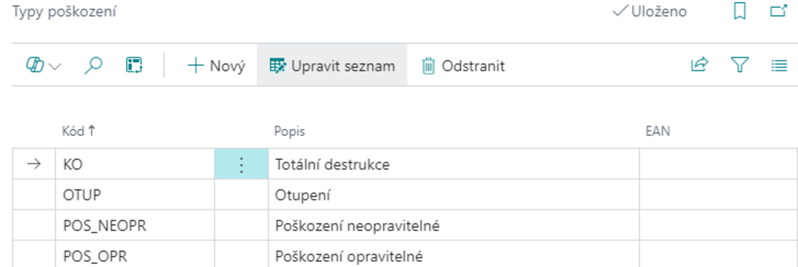

# Production Tools Setup

> Updated: 01.12.2024

To use the module to its full potential, it must be configured according to the needs of the specific company. The individual configuration options are described below.

## Production Tools Journal Templates

1. Choose the  icon, enter **Production Tools Journal Templates** in the search field, then select the relevant link.
2. The **Production Tools Journal Templates** page will open.
3. Click the **+ New** button to create a **New template**.
4. In the **Template Name** field, enter a name that best describes the purpose of this template.
5. In the **Default item type** field, select the item type, for example, **Loan**, if you want the template to be used only for recording loans.
6. In the **Document number series** field, enter or select the number series that will be used to record movements.
7. Save the template by clicking the **Save** button

> [!IMPORTANT]  
> **It is necessary to create at least one tool log template in order to enter tool movements**.
> [!TIP]
> It is possible to have one template for all types of movements, i.e., a template where you do not enter any **Default Item Type** when creating it.

## Adding a Number series

1. Click on the **Number series** field.
2. The **Number series** page will open.
3. Click on the **+ New** button to create a new number series.
4. In the **Code** field, enter a unique identifier for the number series.
5. In the **Description** field, enter a brief description explaining the purpose of the number series.
6. In the **Start Number** and **End Number** fields, enter the start and end numbers of the series.
7. Check the **Default numbers** box if you want the system to automatically generate numbers in this number series.
8. Save the number series by clicking the **Save** button.

## Setting tool record item types

Each log template can have mandatory data checks defined. Follow these steps:

1. Choose the  icon, enter **Tool record item type settings** in the search field, then select the related link.
2. The **Tool record item type settings** page will open.
3. Click the **+ New** button to create a new row for the given item type.
4. Select the item type. The following options are available:
   - **Receipt** – entry of the recorded quantity of the tool.
   - **Issue** – removal of the tool from the inventory.
   - **Loan** – recording of tool loan.
   - **Return** – recording of the return of a loaned tool.
5. For each item type, set the mandatory information that must be filled in the tool log.

> [!NOTE]  
> **Mandatory data helps ensure the accuracy of log entries and proper tool records**.

## Damage Type Settings

Damage type settings are used to distinguish between damaged items in the inventory. This information can be used for possible compensation by employees who return damaged tools, or for later statistical evaluation.

1. Choose the  icon, enter **Damage types** in the search field, then select the relevant link.
2. The **Damage types** page will open.
3. To add a new damage type, click the **+ New** button.
4. Fill in the following fields:
   - **Code** – a unique code for the damage type.
   - **Description** – a verbal description of the damage.
   - **EAN** – a barcode that can be used when working with barcode readers.
5. Fill in the fields as needed and save the settings.

> [!NOTE]  
> **Correctly defining damage types allows for more accurate records and better analysis of tool condition in the future.**.

**See also**  

[Production Tools](production-tools.md)  
[Productivity Pack](productivity-pack.md)
