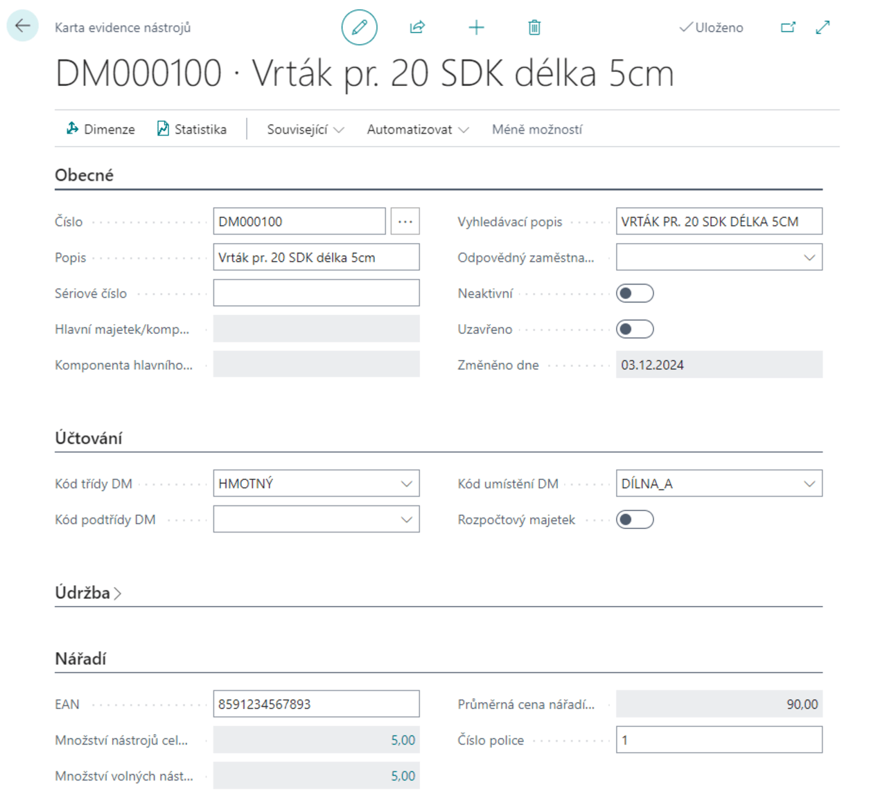
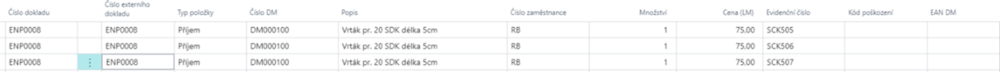

# Production Tools

> Updated: December 1, 2024

Gain full control over your tools and equipment with a smart solution that is directly integrated into Business Central. Track tool movements, minimize losses, and extend tool life with an easy overview of records, loans, inspections, and maintenance. Our **Production Tools** module solves the problem of recording tools, equipment, molds, and other supplies that are usually recorded using the system's inventory records. This module is based on asset records and unifies records for the purposes of tracking fixed assets and production records, including the lending of tools and equipment.

## Key features of the module

- **Tool receipt:** Allows easy registration of each new tool. You get an overview of the availability of equipment from the very beginning.
- **Tool lending:** Facilitates the management of loans, whether for short-term or long-term use. You can track who currently has tools on loan.
- **Tool return:** Provides an overview of the condition of tools upon return and allows for immediate updating of the records.
- **Tool disposal:** Allows for easy disposal of damaged or obsolete tools, creating space for new equipment.

### Tool usage process

Tools are used according to the following scheme:

### Scenarios for using the tool and equipment register

To make your work easier, we have compiled an overview of the most common scenarios you may encounter in everyday practice:

- **Introducing a new tool**
- **Receiving tools into stock**
- **Loaning tools**
- **Returning tools**
- **Issuing tools**

### Introducing a new tool

1. Select the  and enter **Tool inventory overview** in the search engine, then select the relevant link
2. On the **Tool inventory overview** page, select the **New** action.

3. After selecting the **New** action, the **Tool Record Card** will open

    **Each tool record card contains the following fields:**

    - **Number** – select a number series for tool records
    - **Description** – name of the tool
    - **Serial number** – serial number of the tool
    - **Main asset/component** – specifies the main data source of the tool
    - **Main data source component** – specifies the component of the main data source
    - **Search description** – description used to search for the tool
    - **Inactive** – determines whether the tool is active
    - **Closed** – determines whether the tool is blocked
    

4. After filling in the fields in the **Tool Record Card**, the tool will be saved in our **Tool Records**.

    **From the card, you can also use the Related action in the Fixed Assets section**

    - **Overview**: Displays a summary view of the currently selected fixed assets. This overview includes key information such as the description of the asset, its accounting category, current balances, and other relevant data.
    - **Depreciation books**: Provides access to an overview of depreciation books associated with the asset (instrument). Here you can track the history of depreciation, depreciation methods used, and other information about accounting movements of the asset
    - **Notes**: Used to add and manage notes related to specific fixed assets. For example, it allows you to record specific details that are not normally recorded in other parts of the system.
    - **Image**: This feature allows you to attach or view images associated with fixed assets. Images can be useful, for example, for visual identification of assets or documentation.
    - **Maintenance records**: Access to maintenance records for a given fixed asset. This feature is designed to track service interventions, repairs, and other maintenance activities. It helps ensure that assets are kept in working order.
    - **Asset components**: Displays an overview of the components that make up the main asset. This feature is particularly relevant for complex assets that include multiple sub-parts.
    - **Copy DM**: Allows you to create a copy of the current fixed asset record. This feature saves time when creating a new asset with similar parameters to an existing item.
    - **Main asset statistics**: Provides a statistical overview of fixed assets, including, for example, an overview of asset value, depreciation, and balances. This data is useful for financial analysis and planning.
    - **Overview of asset accounting types**: This function displays an overview of all accounting types that have been used for a given fixed asset. It allows you to quickly check how the asset is accounted for.
    - **Total insured amount**: Provides information about the total value of insurance that applies to the asset. This feature helps verify that the asset is adequately insured.
    - **Change log items**: Allows you to view the history of changes made to fixed asset records. This feature is useful for auditing purposes or tracking changes.

### Accessing the tool

1. Choose the  icon, enter **Tool Log** in the search engine, then select the relevant link.
2. Select the template that best suits your needs.
3. Enter the **external document number** in the appropriate field.
4. For **Item Type**, select **Receipt** and select the tool you want to register.
5. Fill in the **Employee Number** field for the person responsible for receiving the tools.
6. Enter the required values in the **Quantity** and **Price** fields.
7. Enter the **Registration Number** of the tool so that individual tools can be clearly identified in future operations.
8. If you use barcode readers, you can also enter the **EAN code**.
9. Click the **Account** button to save the item to the register.
10. All created items can be viewed on the **tool register items** page.

**Illustration using images:**

**Tool Journal Lines:**

> [!IMPORTANT]  
> Required fields for **Item type** **Receipt**: **External document number**, **Employee number**, **Registration number**, **Price**.

### Tool Loan

1. Choose the  icon, enter **Tool Journal** in the search engine, then select the relevant link.
2. Select the template that best suits your needs.
3. Fill in the **DM Number** field.
4. In the **Employee Number** field, select the employee borrowing the tool.
5. Fill in the **Quantity** field.
6. Fill in the **Registration number** field, i.e., the specific tool to be borrowed.
7. If you use barcode readers, you can also enter the **EAN code**.
8. Click the **Charge** button to save the item in the register.
9. All created items can be viewed on the **tool inventory items** page.

**Example using images:**

**Tool Journal Lines:**

> [!IMPORTANT]  
> Required fields for **Item Type** **Loan**: **Employee Number**, **Registration Number**.

### Returning a tool

1. Choose the  icon, enter **Tool Log** in the search box, then select the relevant link.
2. Select the template that best suits your needs.
3. For **Item Type**, select **Return**.
4. In the **DM Number** field, select the tool you want to return.
5. Fill in the **Employee Number** field for the employee returning the tool.
6. Enter the value in the **Quantity** field corresponding to the number of tools being returned.
7. Enter a value in the **Registration Number** field to uniquely identify the specific tool.
8. Fill in the **Damage Code** field, if applicable.
9. If you use barcode readers, you can also enter the **EAN code**.
10. Click the **Account** button to save the item in the records.
11. All created items can be viewed on the **Tool Record Items** page.

**Example using images:**

**Tool Journal Lines:**

> [!IMPORTANT]  
> Required fields for **Item Type** **Return**: **Employee Number**, **Damage Code**, **Registration Number**.

### Tool Issuance

1. Choose the  icon, enter **Tool Log** in the search engine, then select the relevant link.
2. Select the template that best suits your needs.
3. For **Item Type**, select **Issue**.
4. In the **DM Number** field, select the tool you want to issue.
5. Fill in the **Employee Number** field with the number of the person performing the action.
6. Enter a value in the **Registration Number** field to uniquely identify the specific tool.
7. Fill in the **Damage Code** field, if relevant.
8. If you use barcode readers, you can also enter the **EAN code**.
9. Click the **Account** button to save the item in the records.
10. All created items can be viewed on the **Tool Record Items** page.

**Example using images:**

**Tool Journal Lines:**

> [!IMPORTANT]  
> Required fields for **Item Type** **Issue**: **Employee Number**, **Damage Code**, **Registration Number**.

### Tool inventory items

As mentioned above, all created items can be viewed on the **Tool inventory items** tab. Here is how to display this page:

1. Choose the  icon, enterChoose the  icon, enter **Tool inventory items** in the search engine, then select the relevant link.
2. The **Tool Ledger Entries** page will appear, where you can view all entries that have been created.

**See also**  

[Production Tools setup](production-tools-setup.md)  
[Productivity Pack](productivity-pack.md)
