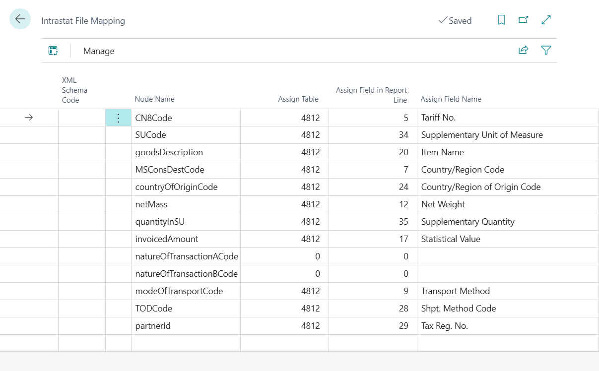

# Intrastat statement

> Update 17.10.2025

For the purpose of generating the Intrastat report, standard functionality is used.

The difference from the standard functionality is in the structure of the file with the extension .xml generated for the purposes of Slovak reporting.

To activate Slovak functionality, these settings are needed, use the following procedure:

## General Ledger Setup

1. Choose the  icon, enter **General Ledger Setup** and then choose the related link.
2. On the **General Ledger Setup** page you must select**SK** in **Legislation**field.
3. Confirm with the **OK** button.

> [!IMPORTANT]
> From version 25 onwards, it is necessary to have the basic functionality set up in *Intrastat reporting settings* (see [documentation](https://learn.microsoft.com/en-us/dynamics365/business-central/finance-how-setup-report-intrastat)).

## Intrastat file mapping

The settings are used to map fields in the application to nodes .xml. This table is part of the supplied configuration package.

1. Choose the  icon, enter **Intrastat File Mapping** and then choose the related link.
2. On the **Intrastat File Mapping** review or complete the settings.
3. Confirm with the **OK** button.

> [!TIP]
> You can find the complete mapping in the Configuration Package, which you can obtain by running the Assisted Setup *Set Up SK Localization* (either import the latest version using the *AssistEdit* button in the existing company or perform a complete import of the sample parameterization in an empty company using the *Apply package* action).

## Export a file for Intrastat

1. Choose the  icon, enter **Intrastat Journals** and then choose the related link.
2. Insert journal lines with the **Suggest Lines...** feature.
3. Export using the function **Export**, it is necessary to fill in *Contact person*, *Type*, *Serial number of the statement*
4. Confirm with the **OK** button.

## See also

[ARICOMA Solution](solutions.md)  
[SK Legislative Pack](sk-legislative-pack.md)
