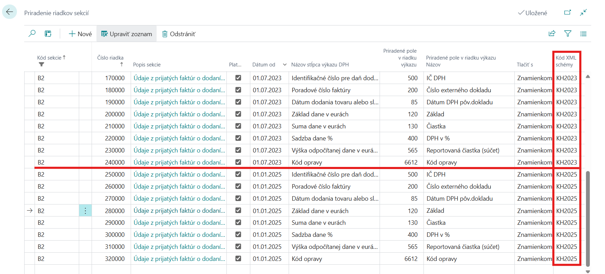

# VAT Control Report - Setup

> Update 21.09.2025

To ensure proper functionality, you need to set up several areas below

## General Ledger Setup

To activate Slovak functionality, follow these steps:

1. Choose the  icon, enter **General Ledger Setup** and then choose the related link.
2. On the **General Ledger Setup** page you must select**SK** in **Legislation**field.
3. Confirm with the **OK** button.

## Setting up XML schemas

> [!TIP]
> Complete settings for the VAT Control Statement can be found in the Configuration Package, which you can obtain by running the Assisted Setup *Set SK Localization* (either in a new Company or by selecting to replace an older package in an existing company).

The XML schema for the VAT Control Report must be imported into the application into the XML schemas.

1. Choose the  icon, enter **XML Schemas** and then choose the related link.
2. On the **XML Schemas** page choose **Load Schema** action
3. An import window will open where you select the appropriate XML file.
4. After import, a new line appears on **XML Schemas** page.
5. In the **XML port ID** field, select the value for the relevant year of validity - see the table below.
6. In the **Assing legislation** select **SK**.
7. Confirm with the **OK** button.

>[!NOTE]
>
> | XML port ID | Validity      |
> |   --------  | -------       |
> |   52068871  | from 1.1.2020 |
> |   52068847  | from 1.1.2025 |

## VAT report line settings - extensions

To ensure the correct reporting of the VAT Control Report, it is necessary to set the fields in the lines of the VAT report:

1. Choose the  icon, enter **VAT Statements** and then choose the related link.
2. For each line in the sales tax statement, define the following fields:

   - Source Code filter
   - Document type
   - Document type filter
   - Check VAT Report Section
   - Ch.VAT R. S. for Persons

   

3. Confirm with the **OK** button.

> [!WARNING]
> The **Check VAT Report Section** field must be set on only one line of the VAT statement for the same values in the fields:
>
> - Gen. Posting Type
> - VAT Bus. Posting Group
> - VAT Prod. Posting Group
> - Amount Type
> - Document Type Filter
> - Source Code Filter
>
> If the same section value is set on more than one line for the same field values above, duplication of amounts occurs.

## Setting the sections of the VAT Control Report

Use the following procedure to set up:

1. Choose the  icon, enter **VAT Check Report Section** and then choose the related link.
2. Set up section codes according to applicable reporting regulations.
3. To report received simplified invoices, you need to set the **Section Code Below Limit** and **Section Code Above Limit**. The fields **VAT Amount Limit** and **Limit Valid From** are filled in at the same time.

## Set up VAT Control Report Section Columns

It is necessary to set columns for individual sections, which will be exported to an xml file.

1. Choose the  icon, enter **VAT Check Report Section** and then choose the related link.
2. Select the row for which you want to set columns, and then choose **Action** -> **Section** -> **Column Selection Setup**.
3. Enter the codes according to the valid reporting regulation. In the **Assigned Field field in the report line**, you can set from which system field the value will be populated into the Control Report.

> [!WARNING]
> To maintain the ability to export the Control Report according to various XML schemas, all columns must be defined for each schema.
> 

## See also

[ARICOMA Solutions](solutions.md)  
[SK Legislative Pack](sk-legislative-pack.md)  
[VAT Control Report](sk-vat-check-report-export.md)
