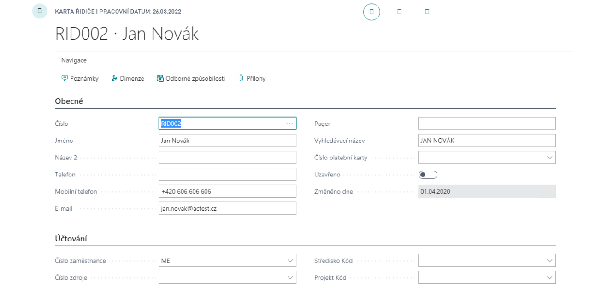
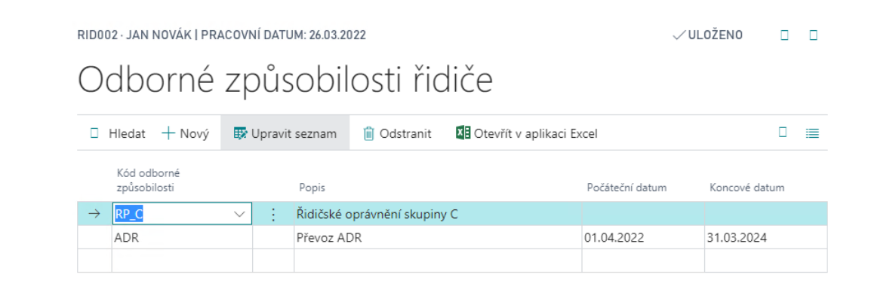
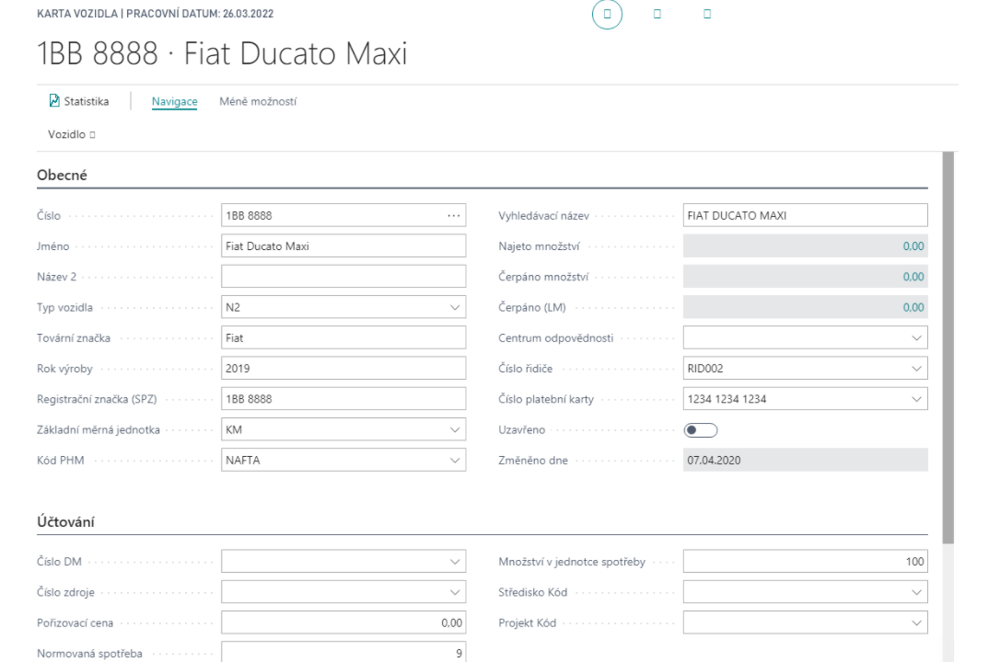
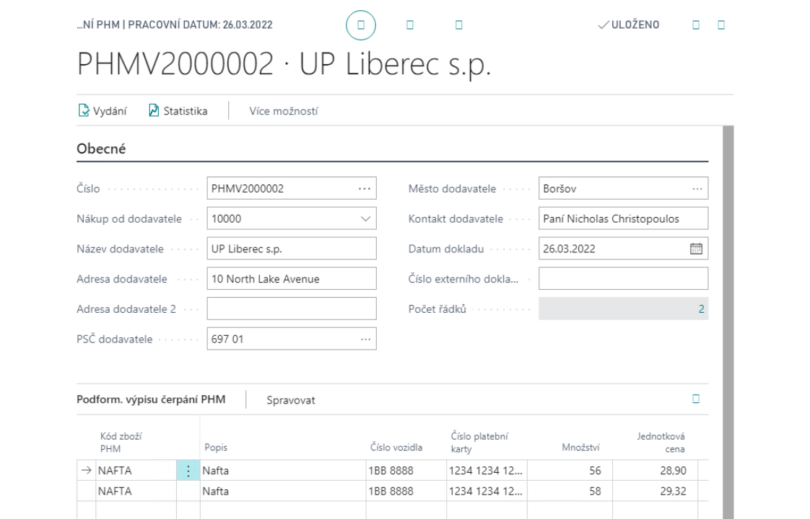
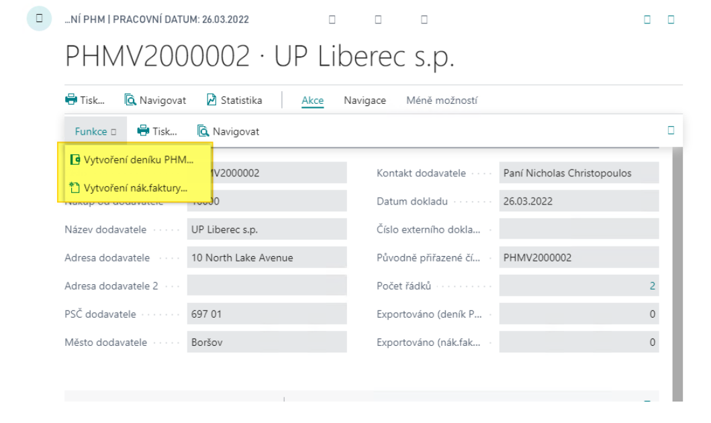
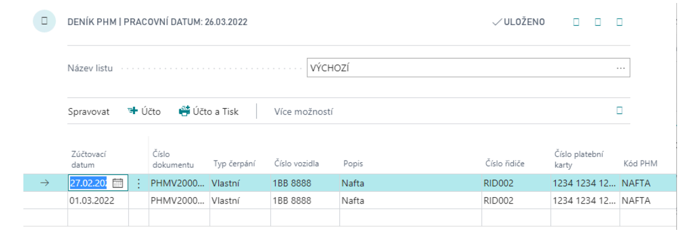
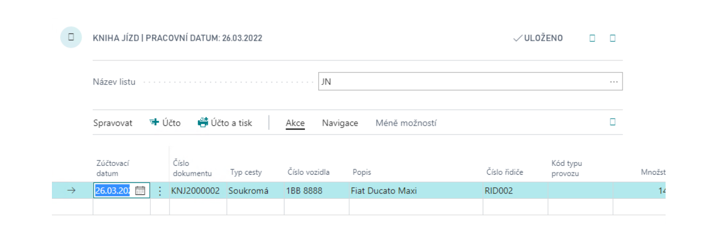
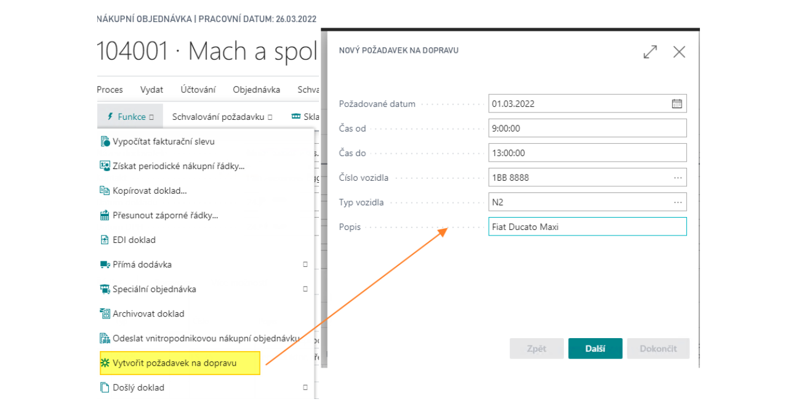
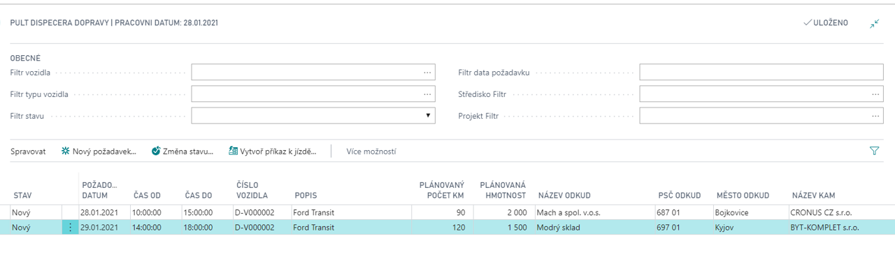

# Transport Operations

**The Transport Operations app** extends Microsoft Dynamics 365 Business Central with a comprehensive set of tools for managing a company fleet, drivers, fuel consumption, and transport planning.

It is designed for organizations operating their own vehicles, from a few company cars to a large transport fleet. The app provides a single integrated solution for recording vehicle trips, tracking fuel and maintenance costs, and coordinating and dispatching transport requests.

## Definition of drivers
The driver card defines the person being tracked and the information associated with them.

To create a new driver, follow these steps:
1. Choose the  icon, enter **Driver List**, and then choose the related link.
2. In the list, select **New**.
3. On the driver card, fill in the required information.

You can store the driver's **qualifications**, such as driving licences and special permits, and set their validity periods. You can find the qualification codes in the navigation section of the driver card.

## Definition of vehicles
Vehicles are defined for consumption monitoring and maintenance. For each vehicle, you can record whether it is company-owned, link an assigned payment card for importing fuel transactions, assign a default driver, and link to other records such as a fixed asset or resource.

To create a vehicle card, follow these steps:
1. Choose the  icon, enter **Vehicle List**, and then choose the related link.
2. In the list, select **New**.
3. On the vehicle card, fill in the required information.

You can define additional vehicle data:
- **Equipment** – equipment assigned to each vehicle.
- **Units of measure** – units used with the vehicle.
- **Cost** – standard costs or prices for each operation type.
- **Consumption** – standard vehicle consumption for each operation type.
- **Maintenance records** – vehicle maintenance tracking, including the next maintenance dates.

## Refuelling Statement
Use the Refuelling Statement to enter fuel consumption for vehicles. Statements can be imported from a vendor file or entered manually.

To create a Refuelling Statement, follow these steps:
1. Choose the  icon, enter **Refuelling Statement**, and then choose the related link.
2. In the list, select **New**.
3. Fill in the required information on the card.
4. Fill in the individual lines and issue the document.

5. The next step is to issue the statement. You can then use the following functions on the issued statement:
    
    - **Create Fuel Journal** – to record fuel transactions for a vehicle.
    - **Create Purchase Invoice** – to create a purchase invoice based on the fuel transactions.

6. The final step is to post the Fuel Journal:
    

## Drive Journal
Use the Drive Journal to record vehicle operations.

To fill in the Drive Journal, follow these steps:
1. Choose the  icon, enter **Drive Journal**, and then choose the related link.
2. Fill in the lines as needed, including the drive type, vehicle number, description, driver number, and operation type.
3. Post the journal.

If you use the extended transport planning functionality, you can generate Drive Journal entries based on issued drive orders.

## Transport planning

Planning uses a **Transport request**, which records expected transport. You can create requests from **Sales orders**, **Purchase orders**, and **Transfer orders** by using the **Create shipping request** function.

To create a request from a purchase order, follow these steps:
1. Choose the  icon, enter **Purchase Orders**, and then choose the related link.
2. Open an existing order or create a new one.
3. Select **Create shipping request**.
4. Complete the Shipping Request Wizard.

The wizard prepopulates as much information as possible from the source document. It is intended for users who process these documents.

The next phase is **Transport Planning** on the **Transport Dispatcher Board** page. The responsible employee can review and process individual requests, schedule dates, assign vehicles and drivers, and combine requests based on available capacity.

The request statuses used in planning are:
- New – the request has been created.
- Scheduled – a drive order has been created.
- Closed – transport has been completed.

**See also**

[Transport Operations - Setup](transport-operations-setup.md)
