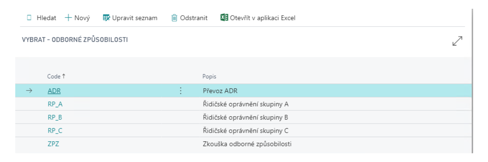
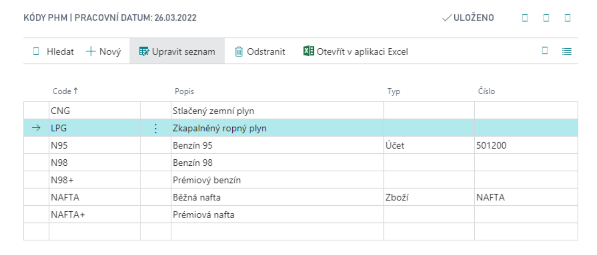
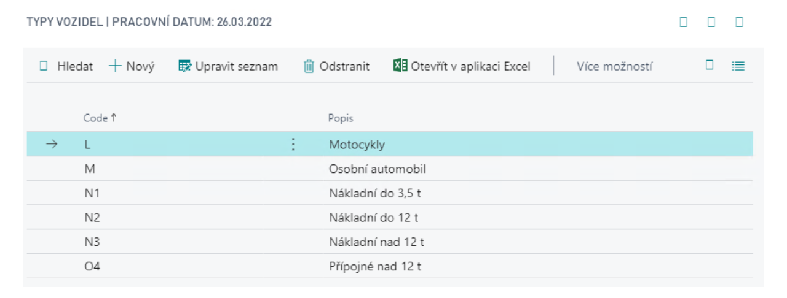
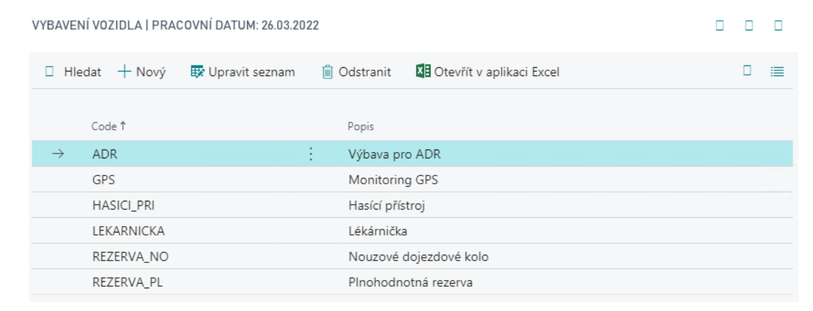
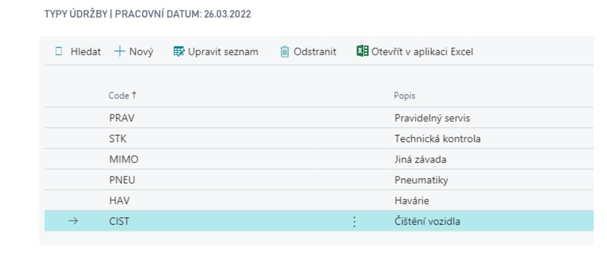
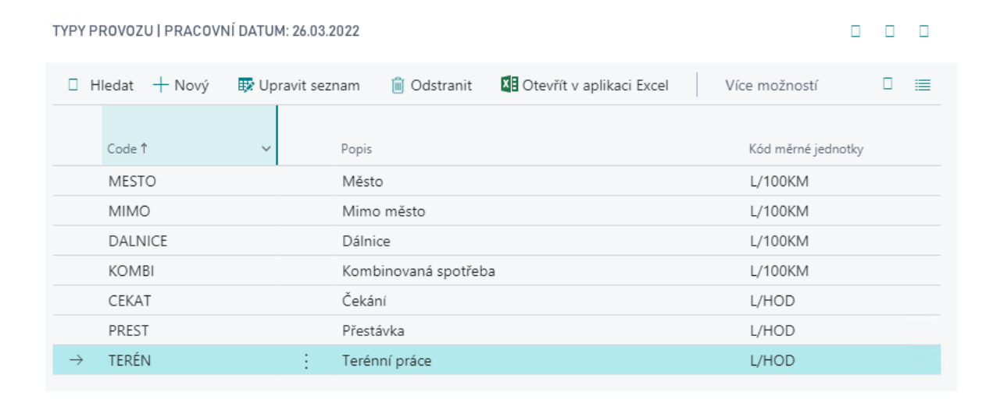
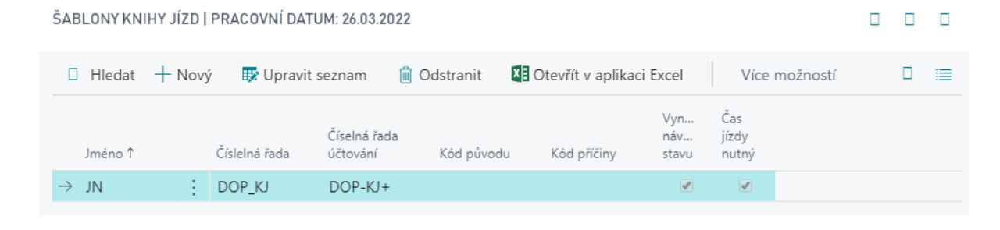
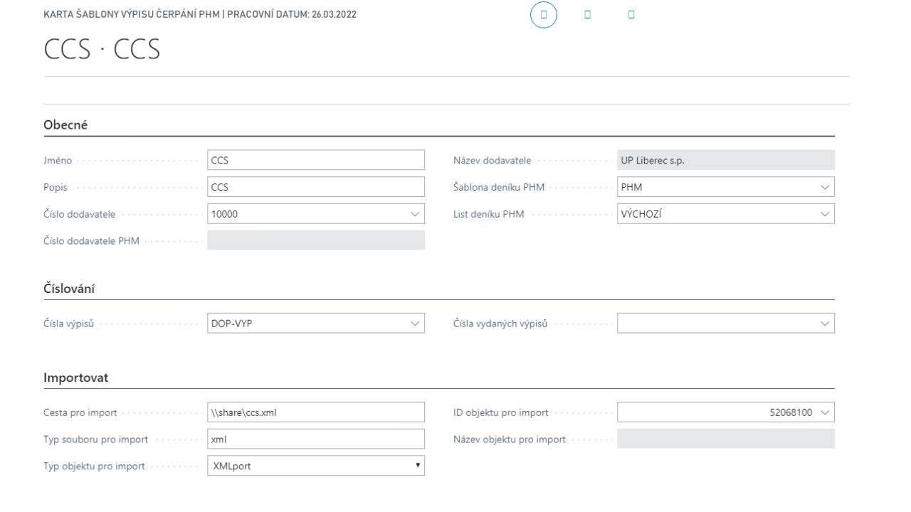

# Transport Operations - Setup

## Transport Setup

To configure the basic transport settings, follow these steps:
1. Choose the  icon, enter **Transport Setup**, and then choose the related link.
2. The Transport Setup page contains several settings:
   - **Vehicle Nos.** – a number series for creating vehicles.
   - **Driver Nos.** – a number series for creating drivers.
3. Transport Setup also provides additional settings and lists in the factbox area:

   

### Professional Qualifications

- A list of codes representing drivers' abilities, skills, and authorizations.
- You can assign these qualifications to individual drivers and specify their validity periods.

### Fuel Codes
A list of fuel types used by vehicles, linked to the items invoiced by their vendors, such as different fuel types or fees. This link is used when creating purchase invoices from refuelling statements.

## Vehicle Types

List the types of vehicles used in your fleet, organized to meet your needs.

## Vehicle Equipment

List the equipment items you want to track for your vehicles.

## Maintenance Types

Use maintenance types to categorize vehicle maintenance according to your needs.

## Operation Types

Use operation types to define different costs and standard vehicle consumption based on the vehicle type.

## Drive Journal Templates

- Templates let you define a journal for a specific record, such as a driver or vehicle.
- Each Drive Journal Template has a line with the following fields:
   - **Force Counter Continuity** – lines must be entered in the order in which the trips took place.
   - **Drive Time Mandatory** – the user must enter the duration of the trip.

## Refuelling Statement Templates

- Use Refuelling Statement Templates to create and track statement templates. Fill in the following fields in each template:

   - **Name** and **Description**.
   - **Statement Nos.** – the number series for refuelling statements.
   - **Issued Statement Nos.** – the number series for issued refuelling statements.
   - The electronic statement processing parameters: **Import Path**, **Import File Type**, **Import Object Type**, **Import Object ID**, and **Import Object Name**.
   - **Vendor No.** – required if purchase invoices are generated from statements.
   - **Fuel Vendor No.** – read-only; copied from the same field on the vendor card. This is the fuel vendor number shown in electronic statements and validated during import.
   - **Fuel Journal Template** – required if fuel journals are generated from statements.
   - **Fuel Journal Batch** – required if fuel journals are generated from statements.

## Vendors

If you use fuel journals, set the following information on the vendor card:
- **Fuel Vendor No.** – validated when a refuelling statement is entered or imported.
- **Fuel Item Vend. Catalog** – identifies items in the vendor's statement and matches them to item cards in Business Central.

**See also**

[Transport Operations](transport-operations.md)
